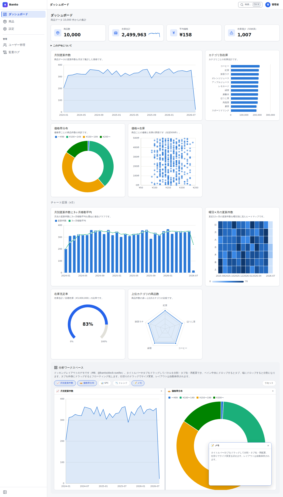
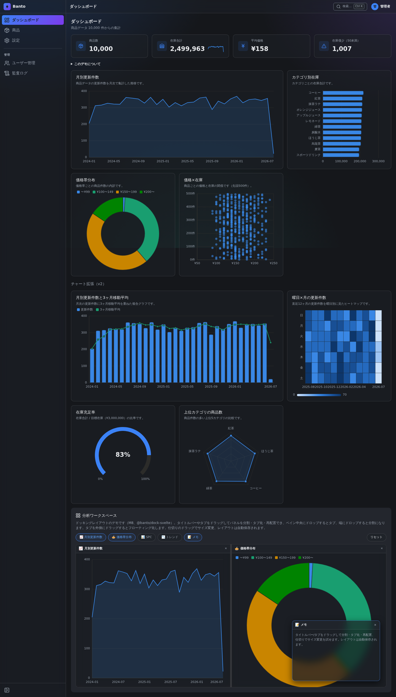
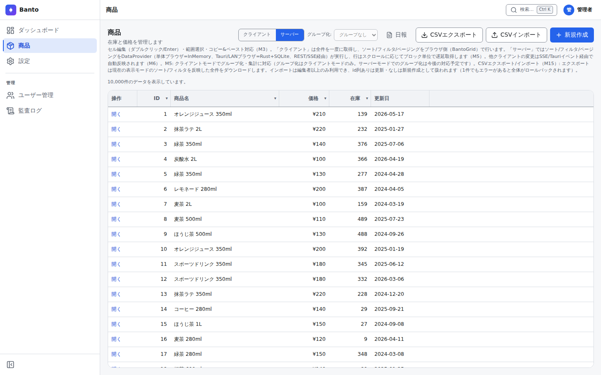

# Banto（番頭）

Tauri v2 + SvelteKit（Svelte 5 Runes）向けのフルスタック管理画面
フレームワーク/テンプレート。refineライクなヘッドレスコアに、独自の
データグリッド・スキーマ駆動フォーム・チャート・ドッキングレイアウトを
組み合わせる。

名称は、江戸時代の商家で主人に代わって店を切り盛りした「番頭」に由来。

- English summary: [README.en.md](README.en.md)
- 仕様書: [docs/ui-framework-spec.md](docs/ui-framework-spec.md)
- 機能拡張ロードマップ（M10〜）: [docs/roadmap.md](docs/roadmap.md)
- 保守者向け規約: [docs/conventions.md](docs/conventions.md)
- 公開手順: [docs/publishing.md](docs/publishing.md)
- ライセンス: [MIT](LICENSE)
- npmスコープ: `@banto/*` / Rustクレート: `banto-*`

## スクリーンショット

**ライブデモ: [tyaro.github.io/banto](https://tyaro.github.io/banto/)** — 単体ブラウザ（デモ）
モード（InMemory・バックエンド不要）で動く。**admin / admin** でログイン可能。

デスクトップ（Tauri）と LAN ブラウザ配信の両方で動く管理画面。1万件のデモデータで、
仮想スクロールのデータグリッド・スキーマ駆動フォーム・各種チャート（折れ線 / 棒 / 円 /
散布 / ヒートマップ / ゲージ / レーダー ほか）・ドッキングレイアウト・明暗テーマ
（standard / glass プリセット）を同梱している。

**ダッシュボード（ライト / standard）**



**ダッシュボード（ダーク / glass プリセット）**



**データグリッド（商品一覧・仮想スクロール / 絞り込み / インライン編集）**



## ドキュメントの2トラック

読者によってドキュメントを2つのトラックに分けている。

- **トラックB（このREADME）= アプリ作者向け**: このテンプレートを**コピーして
  自分のアプリを作る人**向け。リネーム・デモ差し替え・オプション削除・スキャナ
  入力レシピ・セットアップ手順はすべてこの下にある。
- **トラックA（`docs/`）= 保守者向け**: テンプレート**自体を保守・機能拡張する人**
  向け。不変条件（[docs/conventions.md](docs/conventions.md)）・仕様書・スコープ判定
  ・実装計画・配布規約。AIエージェントの道案内は [AGENTS.md](AGENTS.md) / [CLAUDE.md](CLAUDE.md)。

アップストリームを追わずハードフォークするなら、トラックA（`docs/`・`AGENTS.md`・
`CLAUDE.md`）は不要になれば削除してよい（テンプレートの「すべては削除可能」方針）。

## 対象読者 / 非対象

Banto は特定のニッチに最適化したテンプレートで、汎用の管理画面ジェネレータではない。
ニッチは隠すより宣言した方が合う人に速く届く。最初の1画面で「自分向きか」を判断できる
よう、正直に開示する。

**向いている人**

- **デスクトップアプリと LAN ブラウザ配信の両方**が要る業務系（現場端末はデスクトップ、
  事務所は同じ画面をブラウザで）。
- 認証・RBAC（admin / editor / viewer）・監査ログ付きの管理画面を**最初から**欲しい人。
- Tauri v2 + SvelteKit（Svelte 5 Runes）+ Rust の構成で、AI 併走で量産したい人。

**向いていない人**

- Web のみ / デスクトップのみで足りる人（二形態の複雑さが不要）。
- React / Electron の人材・エコシステムに乗りたい人。
- 大規模スケール（分散DB・シャーディング等）が最初から前提の人（PostgreSQL
  単体には V2 で対応済み）。

**言語**: app 層の UI は**英語（一次言語）と日本語**に対応し、設定画面で切り替えられる
（V2 テーマB、Paraglide JS 採用・[ADR-0005](docs/adr/0005-i18n-paraglide.md)）。既定の
表示ロケールは日本語で見た目は不変。共有パッケージ（`@banto/*`）は辞書を持たず、可視文言は
注入された解決済み文字列で受け取る（i18n は app 層のみ、conventions §13）。

**v1 の割り切り（正直な開示）**:

- LAN 配信は標準 HTTP。TLS はリバースプロキシ終端で対応する
  （[docs/adr/0003-tls-via-reverse-proxy.md](docs/adr/0003-tls-via-reverse-proxy.md)）。
- DB は既定でローカル SQLite。V2 で PostgreSQL にもアプリ全体で対応した
  （`BANTO_DB` を `postgres://` にすると切替。バックアップは SQLite 専用）。

## 5分で動かす

前提: Node 24+ / pnpm 10+（Tauri デスクトップとして動かす場合のみ Rust も。
詳細は「開発」「Windowsでのローカルセットアップ」節）。

```sh
git clone https://github.com/tyaro/banto.git my-app
cd my-app
pnpm install
pnpm dev        # http://localhost:1420 （ブラウザ単体デモ、admin / admin でログイン）
```

動いたら、まず見るべき中心の3ファイルはこれ（スキーマ定義・テーブル・サービス層）:

1. `apps/admin-template/src/lib/banto/resources/items.ts` — リソース定義とスキーマ
2. `apps/admin-template/core/migrations-sqlite/0001_items.sql` — テーブル定義
   （PostgreSQL 版は `migrations-postgres/0001_items.sql`）
3. `apps/admin-template/core/src/items.rs` — サービス層（CRUD）

ただし**新しい CRUD リソースを1本通す**には、両経路（REST/Tauri）・認可対称テスト・
ページ・ナビ等を含む**9ステップ**が必要（上の3ファイルはその入口）。正式な手順は
[docs/recipes/add-resource.md](docs/recipes/add-resource.md) のチェックリストに従う
（AI にそのまま指示として渡せる）。

## 主な機能

- **データグリッド**（`@banto/grid-svelte`）: 仮想スクロール、複数列ソート、
  列フィルタ、列リサイズ/並び替え、**列の表示/非表示**（`ColumnsMenu` の
  列マネージャー UI + `GridColumn.hidden` の既定非表示）、Excelライクな
  セル編集・範囲選択・コピー&ペースト、クライアント/サーバー両モード、
  グルーピング+集計。
  フォームスキーマからの**列自動導出**（`columnsFromSchema`、M23 —
  バリデーション込み。「スキーマを1つ書けば一覧とフォームが両方生える」。
  一覧の列順はフォームの入力順と切り離して `order` で指定できる）。
- **スキーマ駆動フォーム**（`@banto/forms`）: 定義オブジェクトから入力UI・
  バリデーション・状態管理を自動生成。
- **チャート**（`@banto/charts`）: 依存ライブラリなしのSVGフルスクラッチ。
  折れ線/エリア・棒・円/ドーナツ・散布図・スパークラインに加え、複合
  （棒+折れ線）・レーダー・ヒートマップ・ゲージ、SPC系（ヒストグラム・
  パレート図・箱ひげ図）、積立エリア（`StackedAreaChart` — 積立棒は
  `BarChart` の `stacked`）・ガントチャート（`GanttChart`）の全14種。
- **ドッキングレイアウト**（`@banto/dock-svelte`）: フローティングウィンドウ +
  分割・タブ化・ドラッグでの再配置・スナップ、レイアウトのJSON保存/復元。
- **refineライクなコア**（`@banto/admin-core`）: リソース定義、
  `DataProvider`/`AuthProvider`抽象、`createListResource`/`createFormResource`
  コンポーザブル。バックエンドはTauri `invoke()`（ローカルRust）を既定に、
  InMemory/HTTP を差し替え可能。
- **組み込みWebサーバ**（`banto-server`）: 設定でオプトイン有効化すると、
  同一LAN内の他端末のブラウザからREST + SSEで同じ画面を利用可能。
- **認証・RBAC・ユーザー管理**（M10）: argon2id 資格情報 + 初回セットアップ、
  admin/editor/viewer の3ロール、ユーザー管理画面。REST/Tauri 両経路で
  同一の権限判定。
- **監査ログ**（M14）+ **設定基盤**（M12、SettingsProvider）+ **自動ログイン/
  ログイン不要モード**（M11）。ログイン無しの小さなアプリとして始めて、育ったら
  ログイン運用へ切り替える手順は
  [docs/recipes/no-login-app.md](docs/recipes/no-login-app.md)。
- **固定ヘッダ/サイドバー + 通知バッジ + ステータス表示**（2026-09）: 本文
  スクロール中もヘッダと左ペインは画面に固定。サイドバーのナビ項目には
  「他クライアントの変更」を知らせる未確認更新バッジ（`NavItem.badgeResource`
  を宣言するだけで自リソースにも付く）、ヘッダにはデモモード/ログイン不要
  モード/現在ロールのステータスチップが標準で付く。設定画面はカテゴリ節
  （外観・言語/アカウント/サーバ・接続/データ管理/セキュリティ）+
  カテゴリジャンプナビに整理。
- **CSV/Excel 入出力**（M15）・**コマンドパレット**（M16、Ctrl+K）・
  **SQLite バックアップ/リストア**（M17）。
- **システム情報カード**（v1.2.0）: 設定画面に admin 専用でアプリバージョン・
  DB 種別・稼働形態などを表示（`GET /api/system/info` / Tauri `system_info`）。
- **対応DBは SQLite（既定）と PostgreSQL**。V2 でアプリ全体を PostgreSQL 上でも
  動かせるようにした（`banto-storage` の `Db`/`Dialect` による方言吸収 + 方言別
  マイグレーション）。`banto-serve` の環境変数 `BANTO_DB` を `postgres://` URL に
  すると PostgreSQL 経路になる（既定はローカル SQLite）。バックアップ/リストアは
  SQLite 専用（PostgreSQL は明示エラー）。仕様 §12.1 参照。
- **PostgreSQL 利用時のバックアップ運用**: 内蔵バックアップ/リストア（設定
  画面のバックアップ節）は SQLite 専用で、PostgreSQL では明示エラーになる。
  PostgreSQL のバックアップは `pg_dump`（例: `pg_dump -Fc banto > banto.dump`）、
  復元は `pg_restore`（または平文形式なら `psql`）を使う。理由（VACUUM INTO /
  起動時ファイル差し替えの PG 対応物が無い）は roadmap §3 の V2 テーマA 項
  （D3）参照。
- **Glassテーマプリセット**（M12）と現代的な UI（M22 ビジュアルリフレッシュ）。
- **オプションの拡張パッケージ**: 帳票/印刷（`@banto/report`、M19）、
  添付ファイル/画像管理（`@banto/attachments`、M20）、バーコード/QR
  スキャナ入力（`@banto/scan-wedge`、M21）、ツリービュー（`@banto/tree-svelte`）。
  帳票・添付・ツリービューは削除可能なデモ配線付き（ツリービューはサイドバーの
  「ツリービュー」= `/tree` デモページ。ライブデモでも触れる）。scan-wedge は
  バックエンド/DB 依存ゼロのため**本体には配線せず**、README のレシピで各アプリに
  直接組み込む（後述「バーコード/QRスキャナ入力」節）。ツリービューの使い方
  レシピも後述「ツリービュー」節に用意。

実装済みマイルストーンの全体像は [docs/roadmap.md](docs/roadmap.md)、変更履歴は
[CHANGELOG.md](CHANGELOG.md) を参照。

## 構成

npm パッケージ（`packages/`、すべて `@banto/*`、ライセンスは
リポジトリ全体と同じ **MIT**（2026-07-12 公開化に伴い統一）。
モノレポ内ではソース直接参照、外部からは git 依存（サブディレクトリ
指定）で消費する — 詳細は [docs/publishing.md](docs/publishing.md)）:

| パッケージ           | 内容                                                                                    |
| -------------------- | --------------------------------------------------------------------------------------- |
| `@banto/admin-core`  | リソース定義・データ/認証プロバイダ・Runesコンポーザブル                                |
| `@banto/grid-svelte` | データグリッド（仮想化・編集・ソート/フィルタ・グルーピング）                           |
| `@banto/forms`       | スキーマ駆動フォーム + 入力コンポーネント                                               |
| `@banto/charts`      | SVGチャート（折れ線/棒/円/散布図/スパークライン/積立エリア/ガント 他）                  |
| `@banto/dock-svelte` | ドッキング/フローティングレイアウト                                                     |
| `@banto/theme`       | CSS変数テーマ + ライト/ダーク/システム切替 + Glassプリセット                            |
| `@banto/report`      | 帳票/印刷（Markdownテンプレート + データバインド、M19）                                 |
| `@banto/attachments` | 添付ファイル/画像管理UI（M20）                                                          |
| `@banto/scan-wedge`  | バーコード/QRスキャナ（キーボードウェッジ）入力検出（M21）                              |
| `@banto/tree-svelte` | ツリービュー（展開/選択/チェックボックス/遅延/ドラッグ/リネーム/tree-grid/tree-select） |

Rust クレート（`crates/`、MIT）:

| クレート               | 内容                                                                                          |
| ---------------------- | --------------------------------------------------------------------------------------------- |
| `banto-core`           | 共通型（ListParams/SortState/FilterState/エラー型）                                           |
| `banto-storage`        | sqlxリポジトリ（SQLite/PostgreSQL。`Db`/`Dialect` で方言を吸収）                              |
| `banto-server`         | 組み込みaxumサーバ（REST・SSE・認証・静的配信・セキュリティヘッダ・汎用ルーター）             |
| `banto-admin-services` | 汎用サービス層（設定/監査/RBAC・ユーザー/バックアップ）。V2 で `admin-template-core` から移設 |
| `banto-attachments`    | 添付ファイルのメタCRUD・保存・サムネイル生成（M20、`@banto/attachments`の裏側）               |

アプリ（`apps/admin-template/`）: Tauri v2 + SvelteKit の管理画面テンプレート
本体。`core/`（tauri非依存のサービス層 `admin-template-core`）と
`src-tauri/`（薄いコマンドアダプタ）に分かれる。

## テンプレートから自分のアプリを作る

Banto は**コピーして使う**前提のテンプレート（[docs/template-scope.md](docs/template-scope.md)
§1）。以下の手順でリネームし、デモコンテンツ（`items` リソース一式）を
自分のリソースに差し替える。

### 1. コピーとリネーム

1. リポジトリをコピー（GitHubの「Use this template」、または
   `git clone` 後に `rm -rf .git && git init` で履歴を切り離す）。
2. **リネームスクリプトを実行**（P2-1。名称・識別子の一括書き換え）:

   ```sh
   node scripts/rename.mjs \
     --name my-app \
     --title "My App" \
     --identifier com.example.myapp \
     --repo https://github.com/me/my-app   # 省略可
   # --dry-run を付けると書き換え内容の事前確認のみ
   ```

   スクリプトが書き換える箇所（手動でやる場合のチェックリストでもある）:
   - ルート `package.json` の `name`/`description`
   - `apps/admin-template/package.json` の `name`（`<name>-app`）と、
     ルート `package.json`・`e2e/playwright.config.ts` の
     `--filter` 参照の追随
   - `apps/admin-template/src-tauri/tauri.conf.json` の
     `productName`/`identifier`（`dev.banto.admin` を自分の逆順ドメイン
     識別子に）・`app.windows[0].title`
   - アプリ内の表示文言（`src/app.html` の `<title>`、
     `src/lib/components/Sidebar.svelte`・`src/routes/login/+page.svelte`
     等の「Banto」表記）と、E2E のログイン見出しアサーション
   - OS keyring のサービス名: `apps/admin-template/src-tauri/src/keyring_store.rs`
     の `SERVICE_NAME`（既定 `"dev.banto.admin-template"` → `--identifier`
     の値。手動でやる場合に見落とすと、新アプリの資格情報が旧テンプレートの
     keyring 識別子のまま同居する）
   - Rust ワークスペース `Cargo.toml` の `workspace.package.repository` と
     各 `packages/*/package.json` の `repository.url`（`--repo` 指定時。
     `@banto/*` パッケージを独自に配布する場合は
     [docs/publishing.md](docs/publishing.md) の scope 問題も参照）

   > **リネームしてはいけないもの**: `X-Banto-Client: banto` CSRFヘッダは
   > 「Banto」の文字列に見えるが、LAN REST の固定プロトコル値であって
   > ブランド名ではない。送信側（`packages/admin-core/src/providers/http.ts`
   > 等の `CLIENT_HEADER_NAME`）と検証側（`crates/banto-server/src/csrf.rs`）
   > の両方にハードコードされており、`banto` を機械的に一括置換すると
   > LAN REST 認証が 403 で全滅する。リネームスクリプトは対象ファイルを
   > 明示列挙するため安全だが、手動置換や `sed -i` での一括置換をする場合は
   > このヘッダを除外すること。

3. スクリプトが**やらない**こと（実行後に案内も表示される）:
   - アイコン: `pnpm --filter <name>-app tauri icon <画像>`
     （下記「Windowsでのローカルセットアップ」節を参照）
   - ルート `README.md`/`LICENSE`（著作権者名）の文言
   - visual regression スナップショットの再生成
     （旧ブランドの見た目で撮られているため
     `pnpm e2e:visual --update-snapshots`）
4. `packages/*` は現状 `@banto/*` のままモノレポ内 `workspace:*` 参照で
   使う分にはリネーム不要（配布する場合のみ検討）。

> ここまでは「banto 自体をフォークして1リポジトリ内で使い続ける」場合の手順。
> **別リポジトリが `@banto/*`/`banto-*` を git 依存として参照する**（コピー
> せず消費する）場合は追加の作業が要る —
> [4. 別リポジトリから git 依存として消費する場合](#4-別リポジトリから-git-依存として消費する場合)
> を参照。

### 2. デモコンテンツ（`items`）を自リソースに差し替える

`items`（商品）は「一覧・詳細・新規作成・CSVインポート/エクスポート・
ダッシュボード集計」を貫通させたお手本として同梱している
（[docs/template-scope.md](docs/template-scope.md) §3）。

**正式な手順は [docs/recipes/add-resource.md](docs/recipes/add-resource.md)**
（チェックリスト形式。AIに委譲するときはレシピをそのまま指示に使える）。
リソースのページは動的ルートによる自動生成ではなく、**`items` のルート
一式をコピーして書き換える**のがこのテンプレートの正式な方式（2026-07-18
決定）。関与ファイルの全量は以下の通り:

| 層                       | ファイル                                                                                                                                | 内容                                                                                                   |
| ------------------------ | --------------------------------------------------------------------------------------------------------------------------------------- | ------------------------------------------------------------------------------------------------------ |
| Rust: マイグレーション   | `apps/admin-template/core/migrations-sqlite/0001_items.sql`（+ `migrations-postgres/0001_items.sql`）                                   | `items` テーブル定義                                                                                   |
| Rust: シード             | `apps/admin-template/core/src/db.rs`（`SEED_ROW_COUNT`・`seed_if_empty`）                                                               | 初回起動時の1,000件デモ投入                                                                            |
| Rust: サービス層         | `apps/admin-template/core/src/items.rs`                                                                                                 | `Item`/`ItemInput`/`ItemImportRow`・CRUD・CSVインポート                                                |
| Rust: REST               | `apps/admin-template/core/src/rest/items.rs`                                                                                            | `items` のルーティング（LANブラウザ向け）                                                              |
| Rust: Tauriコマンド      | `apps/admin-template/src-tauri/src/lib.rs`                                                                                              | `items_list`/`items_get`/`items_create`/`items_update`/`items_delete`/`items_import`、`AppState.items` |
| フロント: リソース定義   | `apps/admin-template/src/lib/banto/resources/items.ts`・同 `resources/index.ts`                                                         | `itemsSchema`/`itemsResource` の定義と `resources` 配列への登録（`setup.ts` が `initBanto` へ渡す）    |
| フロント: デモデータ     | `apps/admin-template/src/lib/banto/sampleData.ts`                                                                                       | ブラウザ単体デモモード（InMemory）用の生成データ                                                       |
| フロント: ページ         | `apps/admin-template/src/routes/(app)/items/`                                                                                           | 一覧（`ItemsClientGrid.svelte`/`ItemsServerGrid.svelte`）・詳細・新規                                  |
| フロント: CSVインポート  | `apps/admin-template/src/lib/banto/itemsAdmin.ts`                                                                                       | バルクインポートAPIクライアント（M15）                                                                 |
| フロント: ナビ           | `apps/admin-template/src/lib/navigation.ts`                                                                                             | `/items` エントリ                                                                                      |
| フロント: ダッシュボード | `apps/admin-template/src/lib/banto/dashboard.ts`・`src/lib/components/DashboardPanel.svelte`・`src/routes/(app)/dashboard/+page.svelte` | `items` から集計するスタットタイル/カテゴリ別在庫等のパネル定義                                        |

進め方の順序・各ステップの注意点・検証コマンドは
[docs/recipes/add-resource.md](docs/recipes/add-resource.md) のチェック
リストに従う。`admin-template-core`/Tauri/REST の三経路で同一のサービス層を
通す構造（[docs/template-scope.md](docs/template-scope.md) §2.1）は維持すること。

> **注意（`sqlx::migrate!` は同一DBに1クレートまで）**:
> `apps/admin-template/core/src/db.rs` はアプリ自身のスキーマを
> `sqlx::migrate!("./migrations-sqlite")` /
> `sqlx::migrate!("./migrations-postgres")` で適用する。`sqlx` の
> マイグレーション管理テーブル（`_sqlx_migrations`）は**データベース全体で
> 1つ**であり、クレートごとにテーブル名を分ける機能は無い。そのため
> `_sqlx_migrations` を内部で使う別クレート（自作の共通クレート等）を
> **同一プール**に対して併用すると、バージョン番号が衝突して
> `MigrateError::VersionMismatch`/`VersionMissing` で必ず失敗する
> （空DBへの初回実行から発生する）。回避策は次のどちらか:
>
> - 併用するクレート側を `sqlx::migrate!` ではなく冪等な DDL
>   （`CREATE TABLE IF NOT EXISTS`、列追加は存在確認してから
>   `ALTER TABLE`）にする
> - アプリ側の `db.rs` を冪等 DDL に寄せ、`sqlx::migrate!` を使うクレートを
>   1つに絞る
>
> いずれにせよ「同一プールに対して `sqlx::migrate!` を呼ぶクレートは常に
> 1つまで」を保つこと。

### 3. オプション資産の削除

以下は「同梱するが削除できる」ことが保証されたオプション資産
（[docs/template-scope.md](docs/template-scope.md) §3）。不要なら
以下の箇所を外す。

まず `pnpm scaffold --preset <preset>`（`minimal` / `standard` / `full`）を試す。
プリセットに応じてオプション資産をまとめて外す（`--interactive` で対話選択、
`--dry-run` で変更内容の確認のみ）。以下の手動手順は、scaffold が触らない資産を
外したい場合や、独自に削りたい場合に参照する。

**`@banto/dock-svelte`（ダッシュボードのドッキングレイアウト）**:
`apps/admin-template/src/routes/(app)/dashboard/+page.svelte` の
`DockHost`/`dock`/`onPopOut` 関連コード、`src/lib/banto/panels.ts`・
`src/lib/banto/popout.ts`・`src/routes/panel/[id]/`（ポップアウト先の
スタンドアロンウィンドウ用ルート）を削除し、ダッシュボードページを固定
レイアウトのパネル羅列に置き換える。`apps/admin-template/package.json` の
`@banto/dock-svelte` 依存と、`apps/admin-template/vite.config.ts` の
`optimizeDeps.exclude` にある `'@banto/dock-svelte'` 行を外す（残すと
`pnpm verify:architecture` の `optimizedeps-svelte-source` が「不要なのに
登録」で落ちる。[ADR-0007](docs/adr/0007-derived-app-dev-optimizer-exclude.md)）。

あわせて **`src-tauri` 側**の以下も外す。ポップアウト専用の配線であり、
残すと呼び出し元のない孤立コード + 不要なウィンドウ権限になる
（`pnpm scaffold` は `src-tauri` を書き換えないため、ここは常に手作業）:

- `apps/admin-template/src-tauri/src/lib.rs` の `panel_open` コマンド
  （関数本体と `invoke_handler` への登録の2箇所）
- `apps/admin-template/src-tauri/capabilities/default.json` の `"windows"`
  配列内 `"panel-*"` エントリ（ポップアウトウィンドウのケイパビリティ許可）

**`@banto/charts`（SVGチャート）**:
`apps/admin-template/src/routes/(app)/dashboard/+page.svelte` の
チャートデモ（トレンド/SPC系パネル）と `src/lib/components/DashboardPanel.svelte`・
`src/lib/banto/dashboard.ts` の集計処理を削除。`items`
自体は他機能（CSVエクスポート等）で使うため残してよい。
`package.json` の `@banto/charts` 依存を外す。

**Glassテーマ + Windows vibrancy（M12）**:
`packages/theme/src/css/banto-glass.css` を削除し
`packages/theme/src/css/banto.css` の `@import './banto-glass.css'`
を外す。`packages/theme/src/index.ts` の `ThemePreset` から `'glass'` を
除去。設定画面（`apps/admin-template/src/routes/(app)/settings/+page.svelte`）
のプリセット選択肢から「ガラス」を外す。デスクトップの本物のガラス感
（Windows Acrylic）も併せて外す場合は `src/lib/banto/vibrancy.ts`、
`src-tauri/src/lib.rs` の `vibrancy_apply`/`vibrancy_status`/
`set_window_vibrancy` と `window-vibrancy` 依存
（`src-tauri/Cargo.toml`）、設定画面のvibrancyトグルを削除する。
プリセット未選択（`standard`のみ）ならCSSは不活性のため、見た目だけ
気にしないなら削除自体は必須ではない。

**コマンドパレット（Ctrl+K、M16）**:
`apps/admin-template/src/lib/components/CommandPalette.svelte`・
`src/lib/commandPalette.svelte.ts`・`src/lib/commands.ts` を削除し、
`src/routes/(app)/+layout.svelte` と `src/lib/components/Header.svelte`
からの参照（`commandPaletteStore`・Ctrl+Kのキーバインド・パレット起動
ボタン）を外す。ナビ定義（`navigation.ts`）からの自動導出のみで構成
されるため、削除してもナビ自体には影響しない。

**添付ファイル機能（`@banto/attachments` + items 添付デモ、M20）**:
以下の順で外すとビルド・テストが引き続き通る（依存の少ない順）。

1. `apps/admin-template/src/routes/(app)/items/[id]/+page.svelte` の
   `AttachmentsPanel` 配線（`M20 demo wiring` コメントのブロック）と
   関連 import（`@banto/attachments`・`isAttachmentsAvailable`・
   `attachmentsClient`）を削除。
2. `apps/admin-template/src/lib/banto/attachmentsClient.ts`・
   `src/lib/banto/attachmentsAdmin.ts` を削除。
3. `apps/admin-template/core/src/rest/attachments.rs`（`attachments_router`
   一式（`attachments_list`/`attachments_upload`/`attachments_delete`等）と
   `items_delete` からの `delete_for_record` 呼び出し・`ItemsWriteState`
   の `attachments` フィールドを外す。`src-tauri/src/lib.rs` も同様に
   `attachments_*` コマンドと `AppState` の `attachments`/`attachments_dir`
   フィールド、`items_delete` の `delete_for_record` 呼び出しを外す。
4. `apps/admin-template/core/src/rest/tests.rs` から attachments 参照を外す
   （`api_router` から attachments 引数が消えるのに追随。外さないと
   `cargo test` がコンパイルできない）: `unused_attachments_service` ヘルパと
   その各呼び出し・`api_router(...)` 実引数の `attachments,`、末尾の
   `// --- M20: attachments` テストブロック（EOF まで、独自の実サービスを含む）を削除。
5. `apps/admin-template/package.json` の `@banto/attachments` 依存、
   ワークスペースの `crates/banto-attachments`（`Cargo.toml` の
   `members` と `admin-template-core`/`admin-template` の依存）を外す。
6. `apps/admin-template/core/migrations-sqlite/0006_attachments.sql`（および
   `migrations-postgres/0006_attachments.sql`）を削除（`attachments` テーブルは
   他のテーブルから参照されないため、単独で安全に外せる）。

**帳票デモ（`@banto/report` + 日報デモ、M19）**:
DB/バックエンド配線を一切持たない最小デモのため、以下だけで外せる。

1. `apps/admin-template/src/routes/(app)/items/+page.svelte` の「日報」
   ボタン（`M19 report demo` コメントの1ブロック）と `FileText` の import
   を削除。
2. `apps/admin-template/src/routes/(app)/items/report/`（ルート丸ごと）と
   `src/lib/banto/reports/`（`daily.md`・`raw.d.ts`）を削除。
3. `apps/admin-template/package.json` の `@banto/report` 依存、
   `src/app.css` の `@import '@banto/report/print.css'` と
   `.banto-report-active` 用の `@media print` ブロックを外す。
   `@banto/report` パッケージ自体（`packages/report`）はテンプレートに
   同梱したままでも他に影響しないが、完全に外す場合は
   `pnpm-workspace.yaml` の対象から漏れないことを確認する。

**ツリーデモ（`@banto/tree-svelte` + `/tree` デモ、M-review 2026-08）**:
DB/バックエンド配線を持たない最小デモ。`pnpm scaffold` の minimal / standard
プリセット（または `--interactive`）で自動削除できる。手動で外す場合は以下。

1. `apps/admin-template/src/routes/(app)/tree/`（ルート丸ごと）と
   `src/lib/banto/treeSample.ts` を削除。
2. `src/lib/navigation.ts` の `'tree'`/`'nav.tree'`（`NavIconKey`/`NavLabelKey`
   の union と navItems の `/tree` 行）、`src/lib/components/navIcons.ts` の
   `tree:` エントリと `ListTree` の import を削除（union とアイコンマップは
   型で連結しているため対で外す）。
3. `src/lib/banto/i18n.ts` の `treeMessages()` と `TreeMessages` import、
   `messages/{ja,en}.json` の `nav.tree`・`tree.*` キーを削除。
4. `apps/admin-template/package.json` の `@banto/tree-svelte` 依存を外す。
   パッケージ本体（`packages/tree-svelte`）は同梱のままでも他に影響しないが、
   ナビが1項目減るぶんサイドバーが写る認証ページのビジュアル回帰ベースライン
   を再生成する（`.github/workflows/visual-baselines.yml` を dispatch）。

### 4. 別リポジトリから git 依存として消費する場合

§1〜3 はすべて「banto 自体をコピー/フォークして1リポジトリ内で使い続ける」
手順。これに対し、**別リポジトリ（例: 社内の案件アプリ）がコピーせずに
`@banto/*`/`banto-*` を git 依存として参照する**構成も取れる。git 依存の
記法そのものは [docs/publishing.md](docs/publishing.md) を参照。ここでは、
§1〜3 の手順を流用する際に追加で必要になる作業を挙げる。

- **npm: `workspace:*` → git 依存への書き換え**: モノレポ内で
  `"@banto/admin-core": "workspace:*"` と参照している箇所を、
  `"@banto/admin-core": "github:tyaro/banto#v1.4.0&path:packages/admin-core"`
  のような git 依存にパッケージ単位で書き換える。
- **Rust: path 依存 → git タグ依存への書き換え**: 消費側 root `Cargo.toml`
  の `[workspace.dependencies]` に
  `banto-core = { git = "https://github.com/tyaro/banto.git", tag = "v1.4.0" }`
  等を追加し、各クレートの依存を `{ workspace = true }` に揃える。特に
  `apps/admin-template/src-tauri/Cargo.toml` の
  `banto-core = { path = "../../../crates/banto-core" }` は**同一リポジトリ内
  であることを前提にした相対パス参照**で、コピー先には `crates/banto-core`
  が存在せず即ビルド不能になる。必ず `{ workspace = true }` に書き換える。
- **`[workspace.package]` に `repository` が必要**: コピーしたクレートの
  `Cargo.toml` は `repository.workspace = true` を持つ。消費側 root
  `Cargo.toml` の `[workspace.package]` に `repository` が無いとビルドエラーに
  なるので、`repository` を追加するか `repository.workspace = true` ごと削除
  する。
- **root `package.json` の devDependencies**: ルートの `eslint.config.js` は
  `@eslint/js`・`typescript-eslint`・`eslint-plugin-svelte`・
  `eslint-config-prettier`・`globals` を import する。lint 設定ごと持ち込む
  なら、この5つを消費側 root の devDependency に入れる。加えて banto 自身は
  `typescript` をパッケージ単位に置いている（root には無い）ため、pnpm の
  非 hoist なワークスペース構成では `typescript-eslint` のパーサ解決のために
  root にも `typescript` が要る場合がある。
- **prettier を新規導入するなら `.prettierignore` を先に整える**: 既存の
  別リポジトリに `.prettierrc.json` を初めて持ち込むと、既存ファイル全部
  （特に `pnpm-lock.yaml`）が整形対象になり巨大な差分が出る。本リポジトリ
  直下の `.prettierignore` を出発点にすること。
- **Vite `optimizeDeps.exclude`**: `@banto/*` はソース配布（未コンパイルの
  `.svelte`/`.svelte.ts`）のため、git 依存として実 node_modules パッケージに
  なると Vite の依存事前バンドルが `.svelte.ts` を解析できず、`pnpm dev` が
  `js_parse_error` で失敗する（`pnpm build`/`pnpm check` は通るため気づき
  にくい）。テンプレートの `apps/admin-template/vite.config.ts` には対策済みの
  `optimizeDeps.exclude` が同梱されているので、**vite 設定を自前で書く場合は
  この exclude を移植する**こと。背景と判断は
  [ADR-0007](docs/adr/0007-derived-app-dev-optimizer-exclude.md)。
- **コピー・リネーム後は `cargo fmt --all` と clippy を通す**: クレート名の
  リネームで `use` 文の並び順が変わったり、デモ（`items`）削除で未使用 import
  が残ったりする。`cargo fmt --all` と
  `cargo clippy --all-targets -- -D warnings` を一度通せば機械的に拾える。
- **e2e スイート（`e2e/`）も移植できる**: `e2e/playwright.config.ts`・
  `global-teardown.ts`・`tsconfig.json` は、ポート番号・クレート名
  （`--filter` / `-p <core-crate>`）・一時DBのプレフィックス程度の差し替えで、
  `PORT`/`BANTO_DB`/`BANTO_ALLOW_SETUP` の環境変数契約（`banto-serve` 由来）
  のまま持っていける。spec 側の落とし穴として、
  `getByRole('heading', { name: '...' })` を `level` 指定なしで使うと、
  ページ本体に同名の見出しを足した画面で Header 側の `<h1>` と二重マッチして
  strict mode violation になる — `{ level: 2, name: '...' }` のようにレベルを
  指定して本体側に絞ること。

## 開発

前提: Node 24+ / pnpm 10+ / Rust（Tauriの[プラットフォーム別前提条件](https://tauri.app/start/prerequisites/)）

```sh
pnpm install

# ブラウザのみで開発（Tauri不要）
pnpm dev                # http://localhost:1420

# Tauriデスクトップアプリとして開発
pnpm --filter admin-template tauri dev

# 検証
pnpm check              # svelte-check + tsc
pnpm build              # SvelteKit 静的ビルド（apps/admin-template/build）
cargo check -p banto-core -p banto-storage -p banto-server
```

### pre-commit フック（任意）

`pnpm format:check` / `pnpm lint` はCIで既にPRをゲートしているため必須では
ないが、コミット前にローカルで同じチェックを走らせたい場合は以下で
オプトインできる:

```sh
git config core.hooksPath .githooks
```

`.githooks/pre-commit` が `pnpm format:check && pnpm lint` を実行し、
失敗時は `pnpm format` での自動修正を案内して非0終了する。1回だけ
スキップしたい場合は `git commit --no-verify` を使う（CIのチェックは
引き続き有効）。依存を増やさない方針のため `husky`/`lint-staged` は
導入しておらず、フック自体はプレーンなPOSIX shスクリプト。

## LANアクセス（組み込みWebサーバ、M6）

デフォルトは無効（`invoke()`専用、攻撃面ゼロ）。設定画面から有効化すると、
同一LAN内の他端末のブラウザから同じ管理画面をREST API + SSEで利用できる
（仕様 §11）。

**有効化手順:**

1. デスクトップアプリの設定画面 →「LANアクセス（組み込みWebサーバ）」で
   トグルをON、バインドアドレス（`0.0.0.0`でLAN公開）・ポート番号を設定し
   「保存して適用」。
2. 表示されたURL/QRコードから、同一LAN内の他端末のブラウザでアクセスし、
   初回起動時（Tauriウィンドウまたはこのブラウザ自身）に作成した
   管理者アカウントでログイン。まだアカウントがなければ初回セットアップ
   画面が表示される。

**`banto-serve`（Tauri不要の開発用バイナリ）:**

```sh
pnpm --filter admin-template build   # apps/admin-template/build を生成
cargo run -p admin-template-core --bin banto-serve --features embed-ui
```

Tauriを起動せずにREST + 静的配信のフルスタックを試せる（`--features
embed-ui`を省略すると組み込みのプレースホルダページを返す）。環境変数
`PORT`（既定8721）/ `BANTO_BIND`（既定`0.0.0.0`）/ `BANTO_DB`（既定
`./banto-dev.sqlite3`）。

**`embed-ui`フィーチャー:**

- `admin-template-core`はデフォルトでフロントエンドを埋め込まない
  （プレースホルダページのみ）。`pnpm --filter admin-template build`で
  フロントをビルドしてから`--features embed-ui`を付けて再ビルドすると、
  実際のSvelteKitビルドが埋め込まれる。
- src-tauri（デスクトップアプリ本体）も同名のパススルーfeatureを持つ:
  `tauri build --features embed-ui`（または`cargo build -p admin-template
--features embed-ui`）を指定しないと、LANアクセス経由のブラウザには
  プレースホルダページしか返らない（Tauriウィンドウ自体の表示には影響
  しない — Webview は常にバンドルされた実フロントを表示する）。

**セキュリティ注意:**

> ⚠️ **LANサーバ機能は標準ではHTTP（平文）です。** ログイン情報・セッション
> トークン・業務データが暗号化されずにネットワークを流れます。公衆Wi-Fi・
> ゲストネットワーク・信頼できない端末が混在するネットワークでは有効化
> しないでください。拠点をまたぐ利用やVPN外での利用が必要な場合は、下記の
> リバースプロキシでTLS終端してください。

- v1は「信頼できるLAN内でのHTTP + トークン認証」という割り切り。TLSは
  未実装（v2以降で検討）。**信頼できるLAN以外では有効化しないこと。**
  HTTPのみのため、ログイン情報やセッショントークンは平文でLAN内を流れる。
- 認証はargon2id資格情報ストア + 初回セットアップ実装済み
  （`crates/banto-admin-services/src/users.rs`。固定パスワードのデモ実装
  ではない）。セッショントークンは絶対8時間/アイドル1時間で自動失効し、
  ログインは5回連続失敗で60秒ロックアウトされる（いずれも
  `banto-server`の`TokenPolicy`/`RateLimitPolicy`で変更可能）。
  Tauriウィンドウのセッションと LANブラウザ側（REST/SSE）のセッションは
  独立したトークン空間。
- セッショントークンはインメモリ保持のため、**サーバ（デスクトップアプリ/
  常駐プロセス）を再起動すると全セッションが失われ、再ログインが必要**になる。
  「ログイン状態を保持（Remember me）」の30日/7日は無停止運用時の上限であり、
  端末を毎日再起動する運用ではその都度セッションが切れる（v1 の受容済み仕様。
  [docs/roadmap.md](docs/roadmap.md) の未決事項一覧を参照）。

**同時書き込みとSQLite（WAL）:**

デスクトップアプリと組み込みサーバは**同一プロセス内で動き、単一の
SQLite コネクションプールを共有する**（Tauriコマンドと REST ハンドラは
同じ `ItemsService` 等 = 同じプールへの `Clone` ハンドルを使う）。したがって
Tauriウィンドウからの書き込みと LANブラウザからの書き込みは**その1つの
プールでシリアライズ**され、プロセスをまたぐ書き込み競合は起きない。DBは
**WAL モード**（`crates/banto-storage/src/sqlite.rs`）で開くため、読み取りは
書き込みをブロックせず、複数の LAN クライアントが同時に閲覧しても問題ない
（SQLite の WAL は「同時に多数の読み取り + 1つの書き込み」を許す）。

注意: 同じ SQLite ファイルに**別プロセスから同時アクセスしない**こと
（例: 稼働中のアプリと並行して 2つ目の `banto-serve` や外部ツールを同じ
DB に向ける）。WAL が保証するのは単一ライタまでで、別プロセスの2つ目の
ライタは `SQLITE_BUSY` を招きうる。バックアップ/リストアはこのシリアライズ
の一部として同一プロセス内で扱う（M17、`VACUUM INTO`）。

**リバースプロキシでのTLS終端（Caddy 例）:**

TLSが必要な環境では、Banto自体はHTTPのまま `127.0.0.1` バインドに絞り、
前段のリバースプロキシでTLSを終端する。[Caddy](https://caddyserver.com/) なら
自己署名/内部CA証明書の自動発行込みで以下の数行で済む:

```
# Caddyfile — https://<このマシンのホスト名>:8443 で待ち受けて Banto へ転送
{
	local_certs   # 内部CAで自動発行（社内CA/正規証明書があればこのブロックは不要）
}

:8443 {
	reverse_proxy 127.0.0.1:8721
}
```

設定画面のバインドアドレスは `127.0.0.1 のみ` にする（`0.0.0.0` のままだと
プロキシを迂回した平文HTTPでも届いてしまう）。

注意: プロキシ経由では、Bantoから見た接続元が全部プロキシのIP
（127.0.0.1）になるため、ログインレート制限の per-IP 次元
（`banto-server` の `RateLimitPolicy.max_ip_failures`、既定20回/60秒）が
**全クライアント合算**で発火するようになる。クライアント台数が多い環境では
しきい値を引き上げるか、per-account 次元（既定5回）だけに頼る設定を検討
する（`X-Forwarded-For` の信頼はv1では未実装 — 偽装可能なヘッダを無条件に
信じないための割り切り）。

**PWA（ホーム画面に追加 / インストール）:**

LANブラウザ配信は Web マニフェスト（`static/manifest.webmanifest` + アイコン）
を同梱しており、ブラウザから「ホーム画面に追加」/「インストール」でアプリの
ように起動できる（工場のタブレット等での常用向け）。オフライン対応（Service
Worker）は入れていない。**ただしブラウザはセキュアコンテキストでしかインストールを
提供しない** — 標準の平文HTTP LAN 配信では機能せず、上記のTLSリバースプロキシ
配下・`localhost`・GitHub Pages デモ（HTTPS）でのみインストール可能になる。
アプリ名を変えるときは [`rename.mjs`](scripts/rename.mjs) が manifest の
`name`/`short_name` も追随させる（アイコン画像は差し替えが必要 — rename が
触らない資産）。

## 利用パッケージ別レシピ（`docs/recipes/`）

個別パッケージをアプリへ組み込む手順は `docs/recipes/` に分けている
（README は「コピー → リネーム → 差し替え → 削除 → 配信」の背骨に集中）:

- **バーコード/QRスキャナ入力**（`@banto/scan-wedge`）: キーボードウェッジ型
  スキャナを人間のタイプと区別して「1スキャン = 1文字列」で通知するヘッドレス
  パッケージ。テンプレート本体には未配線（デモなし）。→
  [docs/recipes/scan-wedge.md](docs/recipes/scan-wedge.md)
- **通知（トースト）**: 画面右下のトースト（`success`/`error`/`info`/`warning`）。
  自タブへの `notify()` と、全クライアント一斉の `ServerEvent::Notice`
  ブロードキャスト。→ [docs/recipes/notifications.md](docs/recipes/notifications.md)
- **ログイン無しの小さなアプリ（チョイアプリ）として始める**: M11 ログイン
  不要モードで始めて、育ったらログイン運用・LAN 配信へ切り替える手順。→
  [docs/recipes/no-login-app.md](docs/recipes/no-login-app.md)
- **ツリービュー**（`@banto/tree-svelte`）: 展開/選択/三状態チェック/遅延読み込み/
  tree-grid/tree-select/ドラッグ・リネーム。サイドバーの「ツリービュー」= `/tree`
  デモとして配線済み（削除可能）。→
  [docs/recipes/tree-svelte.md](docs/recipes/tree-svelte.md)

CRUD リソースの追加・差し替えは [docs/recipes/add-resource.md](docs/recipes/add-resource.md)。

## Windowsでのローカルセットアップ

前提ツール（未導入のもののみ）:

1. **Node.js 24+**: https://nodejs.org/
2. **pnpm 10+**: 管理者不要。`corepack enable pnpm` または `npm i -g pnpm`
3. **Rust**: https://rustup.rs/ （MSVCツールチェーン。インストーラの指示に従い
   Visual Studio Build Tools の「C++によるデスクトップ開発」を入れる）
4. **WebView2 Runtime**: Windows 10/11 は通常プリインストール済み
   （詳細: https://tauri.app/start/prerequisites/ ）

セットアップ（PowerShell / コマンドプロンプト）:

```powershell
cd D:\develop
git clone https://github.com/tyaro/banto.git banto
cd banto
pnpm install

# デスクトップアプリとして起動（初回はRustのコンパイルで数分かかります）
pnpm --filter admin-template tauri dev
```

初回起動時は管理者アカウント作成画面が表示されるので、ユーザー名・
表示名・パスワード（8文字以上）を入力してアカウントを作成する。以降の
起動ではそのアカウントでログインする。Tauriウィンドウ内ではRust+SQLite
（初回起動時に1,000件シード）、ブラウザ実行（`pnpm dev`）ではInMemory
（10,000件）が自動選択される。SQLiteファイルは
`%APPDATA%\dev.banto.admin\admin-template.sqlite3` に作成される。

補足:

- Windowsでは`tauri dev`/`tauri build`に`icons/icon.ico`が必須（同梱済み）。
  独自アイコンに差し替える場合は`pnpm --filter admin-template tauri icon
<画像>`で全形式を再生成できる。
- 認証はargon2id資格情報ストア + 初回セットアップ実装済み（`users`テーブル、
  `crates/banto-admin-services/src/users.rs`）。`pnpm dev`のブラウザ単体
  デモモード（Tauri/バックエンドなし、InMemoryデータ）のみ、Rustバック
  エンドを持たないため`admin` / `admin`固定の簡易セッション認証のまま。
- テーマ・ドックレイアウト等のUI設定は、Tauri/LANブラウザでは SQLite 設定DB
  （`SettingsProvider`、M12で移行済み）へ永続化される。localStorage は初回描画の
  ちらつき防止キャッシュ兼、ブラウザ単体デモモードのフォールバックとして併用する。

## ライセンス

[MIT](LICENSE) © tyaro
