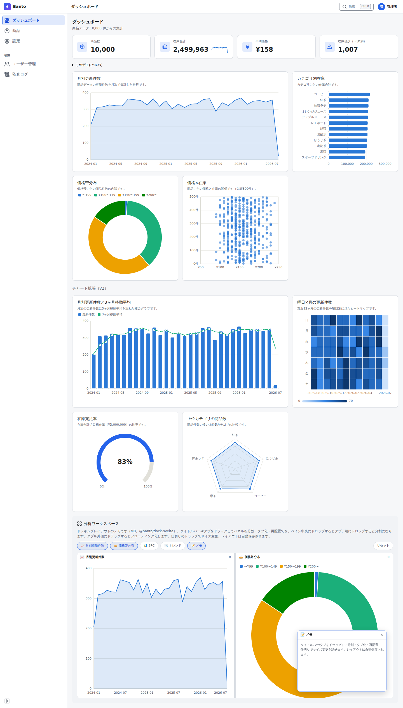
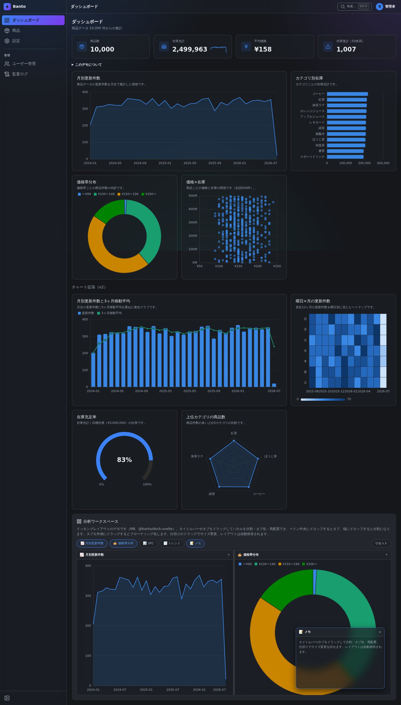
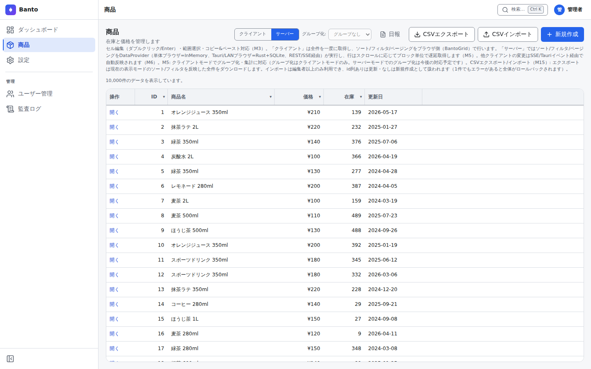

# Banto（番頭）

Tauri v2 + SvelteKit（Svelte 5 Runes）向けのフルスタック管理画面
フレームワーク/テンプレート。refine ライクなヘッドレスコアに、独自の
データグリッド・スキーマ駆動フォーム・チャート・ドッキングレイアウトを
組み合わせ、Rust（axum + sqlx。SQLite 既定・PostgreSQL 対応）バックエンドと
一緒に**デスクトップアプリ（Tauri）と LAN ブラウザ配信の二形態**で動く。
**コピーして自分のアプリを作る**ための雛形で、同梱物はすべて削除できる。

名称は、江戸時代の商家で主人に代わって店を切り盛りした「番頭」に由来。

- **ライブデモ**: [tyaro.github.io/banto](https://tyaro.github.io/banto/) —
  ブラウザ単体のデモモード（InMemory・バックエンド不要）。**admin / admin** でログイン。
- English summary: [README.en.md](README.en.md)
- ライセンス: [MIT](LICENSE)。npm スコープ `@banto/*` / Rust クレート `banto-*`
- 変更履歴: [CHANGELOG.md](CHANGELOG.md)

## 対象読者 / 非対象

Banto は特定のニッチに最適化したテンプレートで、汎用の管理画面ジェネレータではない。
最初の1画面で「自分向きか」を判断できるよう、正直に開示する。

| 向いている人                                                                                            | 向いていない人                                                                                    |
| ------------------------------------------------------------------------------------------------------- | ------------------------------------------------------------------------------------------------- |
| **デスクトップアプリと LAN ブラウザ配信の両方**が要る業務系（現場端末はデスクトップ、事務所はブラウザ） | Web のみ / デスクトップのみで足りる人（二形態の複雑さが不要）                                     |
| 認証・RBAC（admin / editor / viewer）・監査ログ付きの管理画面を**最初から**欲しい人                     | React / Electron の人材・エコシステムに乗りたい人                                                 |
| Tauri v2 + SvelteKit（Svelte 5 Runes）+ Rust の構成で、AI 併走で量産したい人                            | 大規模スケール（分散DB・シャーディング等）が最初から前提の人（PostgreSQL 単体には V2 で対応済み） |

**v1 の割り切り（正直な開示）**:

- LAN 配信は標準 HTTP。TLS はリバースプロキシ終端で対応する
  （[ADR-0003](docs/adr/0003-tls-via-reverse-proxy.md)、手順は [docs/recipes/lan-access.md](docs/recipes/lan-access.md)）。
- DB は既定でローカル SQLite。V2 で PostgreSQL にもアプリ全体で対応した
  （`BANTO_DB` を `postgres://` にすると切替。バックアップは SQLite 専用。
  [docs/recipes/database-backup.md](docs/recipes/database-backup.md)）。

**言語**: app 層の UI は**英語（一次言語）と日本語**に対応し、設定画面で切り替えられる
（Paraglide JS 採用・[ADR-0005](docs/adr/0005-i18n-paraglide.md)）。既定の表示ロケールは
日本語。共有パッケージ（`@banto/*`）は辞書を持たず、可視文言は注入された解決済み
文字列で受け取る（i18n は app 層のみ、[conventions §13](docs/conventions.md#i18n-messages)）。
単一言語の display 系アプリ（カンバン・常設ダッシュボード等）は
`apps/admin-template/package.json` の `banto.i18n` を `"raw"` にすると、この対訳キー方式を
opt-out して UI 文言を直書きできる（既定 `"keys"`、display-preset-plan.md D1-c）。

## 5分で動かす

前提: Node 24+ / pnpm 10+（Tauri デスクトップとして動かす場合のみ Rust も。
[開発](#開発) / [docs/recipes/windows-setup.md](docs/recipes/windows-setup.md)）。

```sh
git clone https://github.com/tyaro/banto.git my-app
cd my-app
pnpm install
pnpm dev        # http://localhost:1420 （ブラウザ単体デモ、admin / admin でログイン）
```

動いたら、まず見るべき中心の3ファイルはこれ（スキーマ定義・テーブル・サービス層）:

1. `apps/admin-template/src/lib/banto/resources/items.ts` — リソース定義とスキーマ
2. `apps/admin-template/core/migrations-sqlite/0001_items.sql` — テーブル定義
   （PostgreSQL 版は `migrations-postgres/0001_items.sql`）
3. `apps/admin-template/core/src/items.rs` — サービス層（CRUD）

ただし**新しい CRUD リソースを1本通す**には、両経路（REST/Tauri）・認可対称テスト・
ページ・ナビ等を含む**9ステップ**が必要（上の3ファイルはその入口）。正式な手順は
[docs/recipes/add-resource.md](docs/recipes/add-resource.md) のチェックリストに従う
（AI にそのまま指示として渡せる）。

## 目的別の入口

やりたいことから、読む文書を引く表。手順の「正」は各リンク先にあり、README は要点だけを持つ。

| やりたいこと                                                             | 読む文書                                                                                                                                                                   |
| ------------------------------------------------------------------------ | -------------------------------------------------------------------------------------------------------------------------------------------------------------------------- |
| テンプレートをコピーして自分のアプリにする（リネーム → 差し替え → 削除） | 本書 [テンプレートから自分のアプリを作る](#テンプレートから自分のアプリを作る)                                                                                             |
| 名称・識別子をリネームする                                               | [docs/recipes/rename.md](docs/recipes/rename.md)                                                                                                                           |
| CRUD リソースを追加する / デモの `items` を差し替える                    | [docs/recipes/add-resource.md](docs/recipes/add-resource.md)                                                                                                               |
| 不要なオプション資産（dock/charts/添付/帳票/ツリー等）を外す             | [docs/recipes/remove-optional-assets.md](docs/recipes/remove-optional-assets.md)（`pnpm scaffold --preset`）                                                               |
| 表示専用アプリ（カンバン / 常設ダッシュボード / 展示デモ）を作る         | 同上の [`--preset display`](docs/recipes/remove-optional-assets.md#--preset-display表示専用アプリ)                                                                         |
| ログイン無しの小さなアプリとして始める                                   | [docs/recipes/no-login-app.md](docs/recipes/no-login-app.md)                                                                                                               |
| RBAC ロールを足す                                                        | [docs/recipes/add-role.md](docs/recipes/add-role.md)                                                                                                                       |
| LAN の他端末に配信する / 閲覧公開 / TLS / PWA                            | [docs/recipes/lan-access.md](docs/recipes/lan-access.md)                                                                                                                   |
| DB の切り替え（SQLite / PostgreSQL）・バックアップ                       | [docs/recipes/database-backup.md](docs/recipes/database-backup.md)                                                                                                         |
| スキャナ入力 / 通知トースト / ツリービューを組み込む                     | [docs/recipes/scan-wedge.md](docs/recipes/scan-wedge.md) / [notifications.md](docs/recipes/notifications.md) / [tree-svelte.md](docs/recipes/tree-svelte.md)               |
| 別リポジトリから `@banto/*` / `banto-*` を git 依存で使う                | [docs/recipes/consume-as-git-dependency.md](docs/recipes/consume-as-git-dependency.md)・[docs/publishing.md](docs/publishing.md)                                           |
| Banto の新しい版を派生アプリに取り込む                                   | [docs/upgrading.md](docs/upgrading.md)（リリース案内の雛形: [docs/release-notes-template.md](docs/release-notes-template.md)）                                             |
| Windows で Tauri デスクトップとして動かす                                | [docs/recipes/windows-setup.md](docs/recipes/windows-setup.md)                                                                                                             |
| 全体構成・レイヤ・フローを一望する                                       | [docs/architecture-overview.md](docs/architecture-overview.md) / [docs/architecture-flows.md](docs/architecture-flows.md)                                                  |
| 仕様・ロードマップ・設計判断（テンプレート自体を保守する）               | [docs/ui-framework-spec.md](docs/ui-framework-spec.md) / [docs/roadmap.md](docs/roadmap.md) / [docs/adr/](docs/adr/README.md) / [docs/conventions.md](docs/conventions.md) |

## ドキュメントの2トラック

読者によってドキュメントを2つのトラックに分けている。

- **トラックB（この README と `docs/recipes/`）= アプリ作者向け**: このテンプレートを
  **コピーして自分のアプリを作る人**向け。リネーム・デモ差し替え・オプション削除・
  LAN 配信・各パッケージの組み込みレシピ・セットアップ手順。README は背骨（コピー →
  リネーム → 差し替え → 削除 → 配信）と入口に絞り、手順の全量は `docs/recipes/` に置く。
- **トラックA（`docs/` のそれ以外）= 保守者向け**: テンプレート**自体を保守・機能拡張する人**
  向け。不変条件（[docs/conventions.md](docs/conventions.md)）・仕様書・スコープ判定
  ・実装計画・配布規約。AI エージェントの道案内は [AGENTS.md](AGENTS.md) / [CLAUDE.md](CLAUDE.md)。

アップストリームを追わずハードフォークするなら、トラックA（`docs/`・`AGENTS.md`・
`CLAUDE.md`）は不要になれば削除してよい（テンプレートの「すべては削除可能」方針）。

## スクリーンショット

デスクトップ（Tauri）と LAN ブラウザ配信の両方で動く管理画面。1万件のデモデータで、
仮想スクロールのデータグリッド・スキーマ駆動フォーム・各種チャート（折れ線 / 棒 / 円 /
散布 / ヒートマップ / ゲージ / レーダー ほか）・ドッキングレイアウト・明暗テーマ
（standard / glass プリセット）を同梱している。

**ダッシュボード（ライト / standard）**



**ダッシュボード（ダーク / glass プリセット）**



**データグリッド（商品一覧・仮想スクロール / 絞り込み / インライン編集）**



## 主な機能

各機能の実装パッケージは次節「構成」、実装済みマイルストーン（M10〜）の全体像は
[docs/roadmap.md](docs/roadmap.md)、変更履歴は [CHANGELOG.md](CHANGELOG.md)。

- **データグリッド**（`@banto/grid-svelte`）: 仮想スクロール、複数列ソート、列フィルタ、
  列リサイズ/並び替え、**列の表示/非表示**（`ColumnsMenu` の列マネージャー UI +
  `GridColumn.hidden` の既定非表示）、Excel ライクなセル編集・範囲選択・コピー&ペースト、
  クライアント/サーバー両モード、グルーピング+集計。フォームスキーマからの
  **列自動導出**（`columnsFromSchema`、M23 — バリデーション込み。「スキーマを1つ書けば
  一覧とフォームが両方生える」。一覧の列順はフォームの入力順と切り離して `order` で指定できる）。
- **スキーマ駆動フォーム**（`@banto/forms`）: 定義オブジェクトから入力 UI・バリデーション・
  状態管理を自動生成。
- **チャート**（`@banto/charts`）: 依存ライブラリなしの SVG フルスクラッチ。折れ線/エリア・
  棒・円/ドーナツ・散布図・スパークラインに加え、複合（棒+折れ線）・レーダー・ヒートマップ・
  ゲージ、SPC 系（ヒストグラム・パレート図・箱ひげ図）、積立エリア（`StackedAreaChart` —
  積立棒は `BarChart` の `stacked`）・ガントチャート（`GanttChart`）の全14種。
- **ドッキングレイアウト**（`@banto/dock-svelte`）: フローティングウィンドウ + 分割・タブ化・
  ドラッグでの再配置・スナップ、レイアウトの JSON 保存/復元。
- **refine ライクなコア**（`@banto/admin-core`）: リソース定義、`DataProvider`/`AuthProvider`
  抽象、`createListResource`/`createFormResource` コンポーザブル。バックエンドは Tauri
  `invoke()`（ローカル Rust）を既定に、InMemory/HTTP を差し替え可能。
- **組み込み Web サーバ**（`banto-server`）: 設定でオプトイン有効化すると、同一 LAN 内の
  他端末のブラウザから REST + SSE で同じ画面を利用可能。ログイン無しの**閲覧公開**・
  TLS 終端・PWA インストールは [docs/recipes/lan-access.md](docs/recipes/lan-access.md)。
- **認証・RBAC・ユーザー管理**（M10）: argon2id 資格情報 + 初回セットアップ、
  admin/editor/viewer の3ロール、ユーザー管理画面。REST/Tauri 両経路で同一の権限判定。
- **監査ログ**（M14）+ **設定基盤**（M12、SettingsProvider）+ **自動ログイン/ログイン不要
  モード**（M11）。デスクトップの初回セットアップ画面で「ログインなしで使い始める」を選べば、
  アカウントを作らずログイン無しの小さなアプリとして始められる（育ったらログイン運用へ
  切り替え可能）。手順は [docs/recipes/no-login-app.md](docs/recipes/no-login-app.md)。
- **固定ヘッダ/サイドバー + 通知バッジ + ステータス表示**（2026-09）: 本文スクロール中も
  ヘッダと左ペインは画面に固定。サイドバーのナビ項目には「他クライアントの変更」を知らせる
  未確認更新バッジ（`NavItem.badgeResource` を宣言するだけで自リソースにも付く）、ヘッダには
  デモモード/現在ロールのステータスチップが標準で付く。設定画面はカテゴリ（外観・言語/
  アカウント/サーバ・接続/データ管理/セキュリティ）ごとのルート（`/settings/appearance` 等）に
  分割し、カテゴリナビ（≥1024px は左レール、それ未満はタブ）で切り替え。
- **CSV/Excel 入出力**（M15）・**コマンドパレット**（M16、Ctrl+K）・**通知トースト**
  （[docs/recipes/notifications.md](docs/recipes/notifications.md)）。
- **SQLite バックアップ/リストア**（M17）: 設定画面から。保存先は DB ファイルごとの
  `<DBの親フォルダ>/backups/<DBファイル名>/`（#280）。PostgreSQL では `pg_dump` を使う。
  旧配置からの移行を含む運用は [docs/recipes/database-backup.md](docs/recipes/database-backup.md)。
- **システム情報カード**（v1.2.0、CPU/メモリは Issue #185 で追加）: 設定画面に admin 専用で
  アプリバージョン・DB 種別・稼働形態・ホスト/プロセスの CPU・メモリ使用率などを表示
  （`GET /api/system/info` / Tauri `system_info`）。
- **対応 DB は SQLite（既定）と PostgreSQL**（V2。`banto-storage` の `Db`/`Dialect` による
  方言吸収 + 方言別マイグレーション）。`BANTO_DB` を `postgres://` URL にすると PostgreSQL
  経路。PostgreSQL のときは添付ファイルの保存先 `BANTO_ATTACHMENTS_DIR` が必須（#208）。
  バックアップ/リストアは SQLite 専用（PostgreSQL は明示エラー）。仕様 §12.1、
  [docs/recipes/database-backup.md](docs/recipes/database-backup.md)。
- **Glass テーマプリセット**（M12）と現代的な UI（M22 ビジュアルリフレッシュ）。
- **オプションの拡張パッケージ**: 帳票/印刷（`@banto/report`、M19）、添付ファイル/画像管理
  （`@banto/attachments`、M20）、バーコード/QR スキャナ入力（`@banto/scan-wedge`、M21）、
  ツリービュー（`@banto/tree-svelte`）。帳票・添付・ツリービューは削除可能なデモ配線付き
  （ツリービューはサイドバーの「ツリービュー」= `/tree` デモページ。ライブデモでも触れる）。
  scan-wedge はバックエンド/DB 依存ゼロのため**本体には配線せず**、レシピで各アプリに直接
  組み込む（[docs/recipes/scan-wedge.md](docs/recipes/scan-wedge.md)。ツリービューは
  [docs/recipes/tree-svelte.md](docs/recipes/tree-svelte.md)）。

## 構成

パッケージ一覧の前に全体像が欲しい場合は
[docs/architecture-overview.md](docs/architecture-overview.md) を参照
（認証・初回起動・開発経路は [docs/architecture-flows.md](docs/architecture-flows.md)）。

npm パッケージ（`packages/`、すべて `@banto/*`、ライセンスはリポジトリ全体と同じ **MIT**
（2026-07-12 公開化に伴い統一）。モノレポ内ではソース直接参照、外部からは git 依存
（サブディレクトリ指定）で消費する — 詳細は [docs/publishing.md](docs/publishing.md)）:

| パッケージ           | 内容                                                                                       |
| -------------------- | ------------------------------------------------------------------------------------------ |
| `@banto/admin-core`  | リソース定義・データ/認証プロバイダ・Runesコンポーザブル                                   |
| `@banto/grid-svelte` | データグリッド（仮想化・編集・ソート/フィルタ・グルーピング）                              |
| `@banto/forms`       | スキーマ駆動フォーム + 入力コンポーネント                                                  |
| `@banto/charts`      | SVGチャート（折れ線/棒/円/散布図/スパークライン/積立エリア/ガント 他）                     |
| `@banto/dock-svelte` | ドッキング/フローティングレイアウト                                                        |
| `@banto/theme`       | CSS変数テーマ + ライト/ダーク/システム切替 + Glassプリセット                               |
| `@banto/report`      | 帳票/印刷（Markdownテンプレート + データバインド、M19）                                    |
| `@banto/attachments` | 添付ファイル/画像管理UI（M20）                                                             |
| `@banto/scan-wedge`  | バーコード/QRスキャナ（キーボードウェッジ）入力検出（M21）                                 |
| `@banto/tree-svelte` | ツリービュー（展開/選択/チェックボックス/遅延/ドラッグ/リネーム/tree-grid/tree-select）    |
| `@banto/ui`          | 汎用 UI 部品（PageHeader・SurfaceCard・StatusBadge・IconButton・Empty/Error/LoadingState） |

Rust クレート（`crates/`、MIT）:

| クレート               | 内容                                                                                          |
| ---------------------- | --------------------------------------------------------------------------------------------- |
| `banto-core`           | 共通型（ListParams/SortState/FilterState/エラー型）                                           |
| `banto-storage`        | sqlxリポジトリ（SQLite/PostgreSQL。`Db`/`Dialect` で方言を吸収）                              |
| `banto-server`         | 組み込みaxumサーバ（REST・SSE・認証・静的配信・セキュリティヘッダ・汎用ルーター）             |
| `banto-admin-services` | 汎用サービス層（設定/監査/RBAC・ユーザー/バックアップ）。V2 で `admin-template-core` から移設 |
| `banto-attachments`    | 添付ファイルのメタCRUD・保存・サムネイル生成（M20、`@banto/attachments`の裏側）               |

アプリ（`apps/admin-template/`）: Tauri v2 + SvelteKit の管理画面テンプレート本体。
`core/`（tauri 非依存のサービス層 `admin-template-core`）と `src-tauri/`（薄いコマンド
アダプタ）に分かれる。

## テンプレートから自分のアプリを作る

Banto は**コピーして使う**前提のテンプレート（[docs/template-scope.md §1](docs/template-scope.md)）。
背骨は「コピー → リネーム → 差し替え → 削除 → 配信」の5段で、各段の要点とコマンドだけを
ここに置き、全量は `docs/recipes/` の各レシピにある。

### 1. コピーとリネーム

リポジトリをコピー（GitHub の「Use this template」、または `git clone` 後に
`rm -rf .git && git init`）し、リネームスクリプトで名称・識別子を一括書き換えする:

```sh
node scripts/rename.mjs \
  --name my-app \
  --title "My App" \
  --identifier com.example.myapp \
  --repo https://github.com/me/my-app   # 省略可
# --dry-run を付けると書き換え内容の事前確認のみ
```

書き換える箇所の全量（`package.json`・`tauri.conf.json`・表示文言・OS keyring のサービス名・
Web マニフェスト等）、スクリプトが**やらない**こと（アイコン・LICENSE・visual スナップショット）、
**リネームしてはいけない** `X-Banto-Client` CSRF ヘッダの注意は
[docs/recipes/rename.md](docs/recipes/rename.md)。

### 2. デモコンテンツ（`items`）を自リソースに差し替える

`items`（商品）は一覧・詳細・新規作成・CSV インポート/エクスポート・ダッシュボード集計を
貫通させたお手本。リソースのページは動的ルートによる自動生成ではなく、**`items` の
ルート一式をコピーして書き換える**のがこのテンプレートの正式な方式（2026-07-18 決定）。
**正式な手順・層別の関与ファイル全量・`sqlx::migrate!` を同一 DB で2クレート以上使えない
注意は [docs/recipes/add-resource.md](docs/recipes/add-resource.md)**（チェックリスト形式。
AI に委譲するときはレシピをそのまま指示に使える）。

### 3. オプション資産の削除

「同梱するが削除できる」ことが保証されたオプション資産
（[docs/template-scope.md §3](docs/template-scope.md)）は、`pnpm scaffold` のプリセットで
まとめて外す:

```sh
pnpm scaffold --preset <preset>   # minimal | standard | full | display
pnpm install                      # 外れた依存の反映
# --interactive で資産ごとに対話選択、--dry-run で変更内容の確認のみ
```

| プリセット | 残すもの                                                                                                                                                                                   |
| ---------- | ------------------------------------------------------------------------------------------------------------------------------------------------------------------------------------------ |
| `minimal`  | コアのみ（charts / dock / Glass / コマンドパレット / 添付 / 帳票 / ツリーを外す）                                                                                                          |
| `standard` | ダッシュボード体験（charts / dock / Glass / コマンドパレット）を残し、添付 / 帳票 / ツリーを外す                                                                                           |
| `full`     | 何も外さない（出荷状態）                                                                                                                                                                   |
| `display`  | 表示専用アプリ向け。`minimal` に加えて `items` 一式・users/audit-log **画面**・`/dashboard` を外し、`/monitor` と閲覧公開・キオスク・`banto.i18n = "raw"` の既定を**足す**唯一のプリセット |

資産ごとの手動手順（scaffold が触らない `src-tauri` 側のポップアウト配線・システムメトリクス
`sysinfo` を含む）と `--preset display` の詳細（外れるもの・初回起動の既定・セキュリティ注意）は
[docs/recipes/remove-optional-assets.md](docs/recipes/remove-optional-assets.md)。

### 4. 別リポジトリから git 依存として消費する場合

§1〜3 は「banto 自体をコピー/フォークして1リポジトリ内で使い続ける」手順。別リポジトリ
（例: 社内の案件アプリ）がコピーせずに `@banto/*`/`banto-*` を git 依存として参照する構成も
取れる。記法は [docs/publishing.md](docs/publishing.md)、追加で必要になる作業（`workspace:*`
→ git 依存、`path` → git タグ依存、`[workspace.package].repository`、Vite `optimizeDeps.exclude`
の移植、e2e の移植等）は
[docs/recipes/consume-as-git-dependency.md](docs/recipes/consume-as-git-dependency.md)。

### 5. 新しい版への更新

依存タグの上げ方、コピーしたテンプレート部分の取り込み、DB 移行、基準版の記録は
[docs/upgrading.md](docs/upgrading.md)。**依存タグを上げるだけではコピー済みのテンプレートは
更新されない。**

## 開発

前提: Node 24+ / pnpm 10+ / Rust（Tauri の[プラットフォーム別前提条件](https://tauri.app/start/prerequisites/)）。
Windows の手順は [docs/recipes/windows-setup.md](docs/recipes/windows-setup.md)。

```sh
pnpm install

# ブラウザのみで開発（Tauri不要）
pnpm dev                # http://localhost:1420

# Tauriデスクトップアプリとして開発
pnpm --filter admin-template tauri dev

# 検証
pnpm check              # svelte-check + tsc
pnpm build              # SvelteKit 静的ビルド（apps/admin-template/build）
cargo check -p banto-core -p banto-storage -p banto-server
```

開発ループは3経路（同じ SvelteKit アプリで provider と永続化が違う。
[docs/architecture-flows.md §6](docs/architecture-flows.md)）:

| 経路 | コマンド                                                                                                        | mode     | 向いていること                                                                |
| ---- | --------------------------------------------------------------------------------------------------------------- | -------- | ----------------------------------------------------------------------------- |
| A    | `pnpm dev`                                                                                                      | `demo`   | UI だけの高速イテレーション。Rust / Tauri 不要                                |
| B    | `pnpm --filter admin-template build` → `cargo run -p admin-template-core --bin banto-serve --features embed-ui` | `server` | LAN / REST を Tauri なしで確認（[lan-access.md](docs/recipes/lan-access.md)） |
| C    | `pnpm --filter admin-template tauri dev`                                                                        | `tauri`  | 本番に近いデスクトップ。`invoke`・キーリング・LAN トグル                      |

### pre-commit フック（任意）

`pnpm format:check` / `pnpm lint` は CI で既に PR をゲートしているため必須ではないが、
コミット前にローカルで同じチェックを走らせたい場合は以下でオプトインできる:

```sh
git config core.hooksPath .githooks
```

`.githooks/pre-commit` が `pnpm format:check && pnpm lint` を実行し、失敗時は
`pnpm format` での自動修正を案内して非0終了する。1回だけスキップしたい場合は
`git commit --no-verify` を使う（CI のチェックは引き続き有効）。依存を増やさない方針のため
`husky`/`lint-staged` は導入しておらず、フック自体はプレーンな POSIX sh スクリプト。

## LANアクセス（組み込みWebサーバ）

デフォルトは無効（`invoke()` 専用、攻撃面ゼロ）。デスクトップアプリの設定画面 →
「LANアクセス（組み込みWebサーバ）」でトグルを ON、バインドアドレス・ポートを設定して
「保存して適用」すると、表示された URL/QR コードから同一 LAN 内の他端末のブラウザで
同じ画面を使える（REST + SSE、仕様 §11）。

> ⚠️ **LAN サーバ機能は標準では HTTP（平文）。** ログイン情報・セッショントークン・
> 業務データが暗号化されずにネットワークを流れる。信頼できる LAN 以外では有効化しない。
> TLS が要る場合はリバースプロキシで終端する。

有効化の詳細、ログイン無しの**閲覧公開**（表示専用アプリ向け）、Tauri 不要の開発用バイナリ
`banto-serve` と環境変数、`embed-ui` フィーチャー、セッション/レート制限の仕様、
SQLite（WAL）の同時アクセス、Caddy による TLS 終端とプロキシ越しの注意、PWA インストールは
[docs/recipes/lan-access.md](docs/recipes/lan-access.md)。

## Windowsでのローカルセットアップ

Node.js 24+ / pnpm 10+ / Rust（MSVC ツールチェーン + Visual Studio Build Tools）/
WebView2 Runtime を入れて `pnpm install` → `pnpm --filter admin-template tauri dev`。
初回起動で管理者アカウントを作成する。前提ツールの入手先・SQLite ファイルの置き場
（`%APPDATA%\dev.banto.admin\admin-template.sqlite3`）・アイコン差し替え等の補足は
[docs/recipes/windows-setup.md](docs/recipes/windows-setup.md)。

## ライセンス

[MIT](LICENSE) © tyaro
