# Banto フロー図 — 認証・起動・開発・リソース追加

全体像は [architecture-overview.md](./architecture-overview.md)（特に §3 レイヤ・§6 典型フロー）を先に読む想定。

対象: ログイン／LAN／閲覧公開、初回起動、開発の3経路、CRUD 追加がどの層に載るかを知りたい人。

> **更新（2026-09-30）**: §2（`(app)` ガード）と §3（ログイン・ログアウト）は v2.0.0 の流れ（SessionController・`resolveSettled`・`publicViewerFallback`・保護レイアウトの 3 本の配線、#260・[ADR-0016](./adr/0016-session-controller-single-writer.md)）で描いている。

## 目次

1. [起動時の3環境と provider 選択](#1-起動時の3環境と-provider-選択)
2. [保護ルートへの入り方（`(app)` ガード）](#2-保護ルートへの入り方app-ガード)
3. [ログイン（資格情報 → トークン）とログアウト](#3-ログイン資格情報--トークンとログアウト)
4. [閲覧公開（合成 viewer）の位置づけ](#4-閲覧公開合成-viewer-の位置づけ)
5. [初回起動・セットアップ](#5-初回起動セットアップ)
6. [開発ループの3経路](#6-開発ループの3経路)
7. [add-resource × レイヤ対応](#7-add-resource--レイヤ対応)
8. [関連ドキュメント（リポジトリ）](#関連ドキュメントリポジトリ)

---

## 1. 起動時の3環境と provider 選択

`apps/admin-template/src/lib/banto/setup.ts` が `bantoReady` 解決時に一度だけ分岐する。

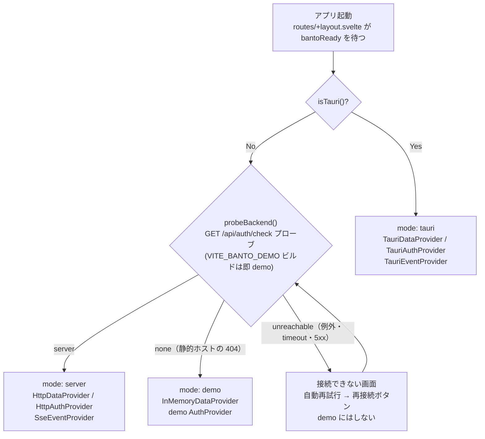

### 読み方

- **Tauri Webview** — `invoke()` のみ。LAN 向け HTTP は別プロセス内の組み込みサーバ（設定で ON のとき）。
- **embedded server** — 同一オリジンの REST + SSE。`banto-serve` や LAN ブラウザもここ。
- **demo** — `VITE_BANTO_DEMO=1` ビルド（Pages 等）、または `vite preview` 等で静的ホストが「API なし」と明確に答えたとき。通信失敗は demo にせず再試行画面（#286）。InMemory + デモ認証。
- 画面コンポーネントは **mode を分岐しない**（`getDataProvider()` / `getAuthProvider()` 経由のみ）。

---

## 2. 保護ルートへの入り方（`(app)` ガード）

セッションの状態（誰がログインしているか）を書くのは **SessionController だけ**（v2.0.0、[ADR-0016](./adr/0016-session-controller-single-writer.md)。設計は [session-controller-design.md](./session-controller-design.md) §6.1）。`(app)/+layout.ts` の `load` は `bantoReady` の後に controller で確認し、確認できた generation を返すだけで、ストアには書かない。

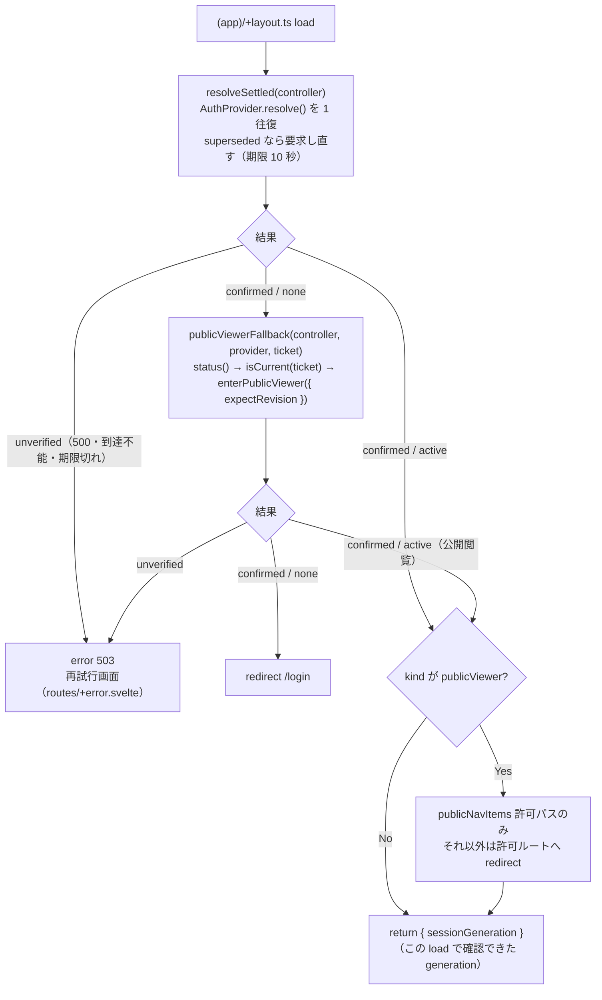

保護レイアウト（`(app)/+layout.svelte`）は controller のスナップショットを見て 3 本の配線を持つ:

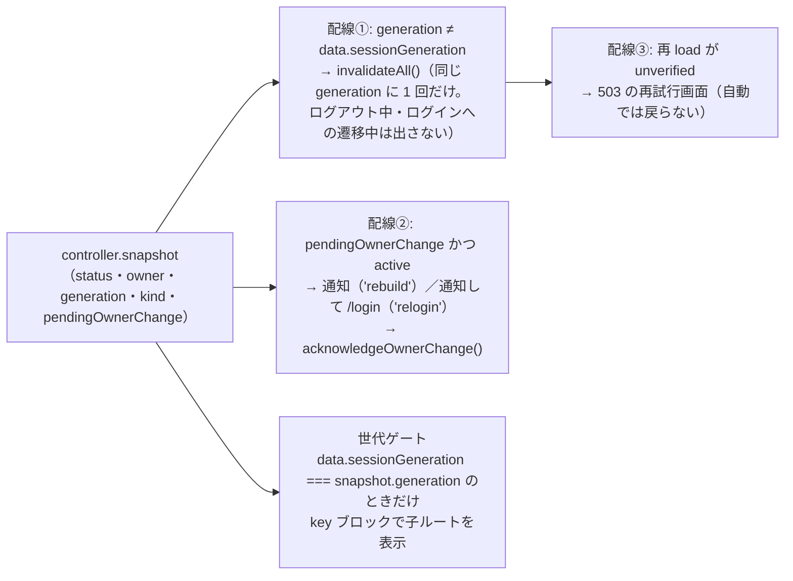

### 読み方

- **`load` の副作用は controller の確認（と、`none` のときの公開閲覧の発行）だけ**。`sessionStore`（identity・role・publicViewer・authDisabled）は `controller.snapshot` からの `$derived` で、`load` の中で代入しない（`authDisabled` は `kind === 'local'`）。
- **有効トークン**があれば `resolve()` の答えで active を確定する（Remember me は HTTP 側の localStorage）。**無効・未ログイン**が確定し、かつ **閲覧公開 ON** の LAN だけ、確定した `none` の ticket に結び付けて合成 `viewer` トークンを発行する（ADR-0012）。Tauri ウィンドウと demo にはこの入口はない。
- 確認できない（サーバ到達不能・500・期限切れ）は **503 の再試行画面**（トークンは消さない — Issue #204）。発行の後の確認の失敗も 503 で、ログイン画面へは行かない。
- **「再試行」は `invalidateAll()`**（controller を維持した画面内の再読込）。503 の間に確定したユーザーの変更（`pendingOwnerChange`）は、保護レイアウトが再び mount したときに通知される（S-81）。ページ全体の再読込では controller ごと作り直されるので、この通知は保証しない。
- 別タブのログイン・ログアウト（共有の Remember me トークンの `storage` イベント）で、このタブの active なセッションは **保留（unknown）** になり、generation が変わる → 配線①が再 load → 新しいユーザーで作り直す（none を経ない切り替えも拾う）。`onSessionEnded` は none への遷移だけを通知するので、保護レイアウトの再 load は配線①で行う。
- SSE の失効（`401`）や他タブでのトークン消去は `connectEvents` が `controller.signal()` に変える。確認と退避（1 秒から倍々で 30 秒まで）は controller の中。
- `publicViewer` は **画面ナビの allowlist** 用。データアクセスの境界は RBAC の `viewer` ロール側。

---

## 3. ログイン（資格情報 → トークン）とログアウト

LAN / 組み込みサーバ経路の例。Tauri は同じ契約を `invoke(auth_login)`・`auth_resolve` に載せ替える（トークンではなく Rust 側のセッションのスロットと `seq`）。

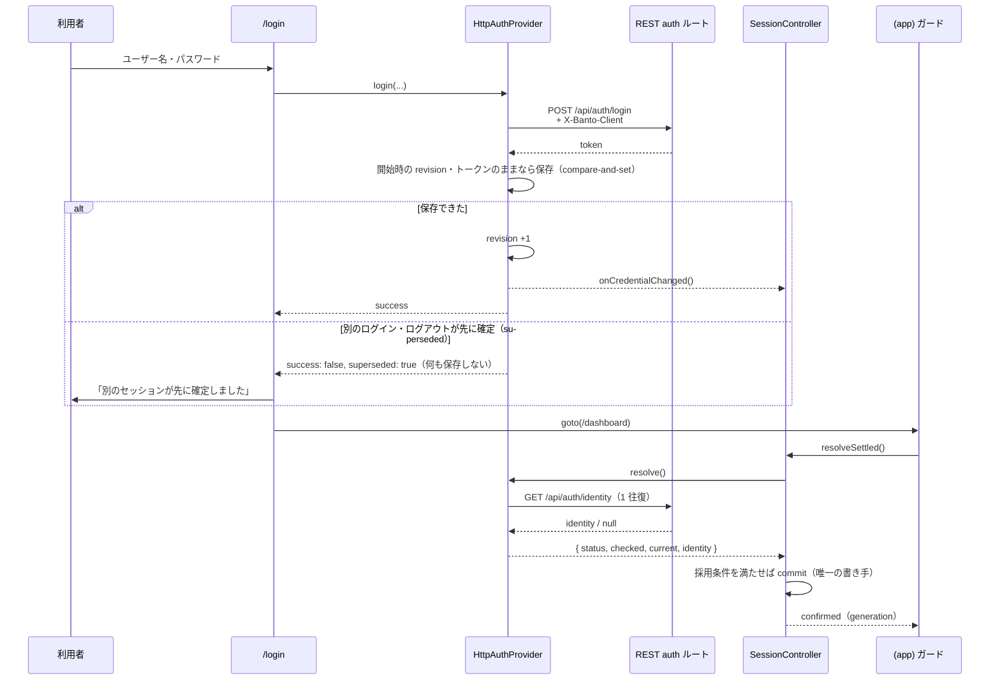

ログアウト（`Header.svelte`・コマンドパレット → `$lib/banto/logout.svelte.ts`）:

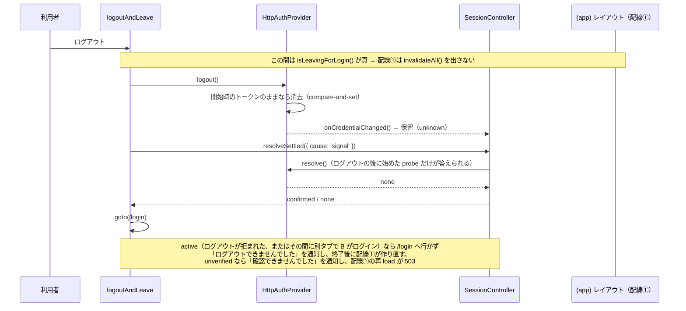

### 読み方

- 初回未初期化 DB では **setup** 画面（管理者作成）が先。initialized は `GET /api/auth/status` 等。
- HTTP リクエストは **CSRF 用カスタムヘッダ** + **Bearer トークン**（ログイン後）。
- **ログインの結果は画面が直接書かない**。provider は資格情報を compare-and-set で保存して通知するだけで、誰がログインしているかは次の `load` の `resolveSettled()` で controller が確定する（I-10）。
- **ログアウトも `end()` を呼ばない**。`logout()` の後の `resolveSettled()` が `none` を確定したときだけ `/login` へ移る。ログイン画面はログアウトの確定の後にしか出ない（そこで送ったログインが、まだ終わっていないログアウトの compare-and-set に負けないように）。
- デスクトップの **認証無効モード（M11）** は Tauri 専用。provider の `resolve()` が `kind: 'local'` を返し、`sessionStore.authDisabled` はそこから導く。LAN との併用ルールは設定画面と `viewer-public` 計画書が一次情報。

---

## 4. 閲覧公開（合成 viewer）の位置づけ

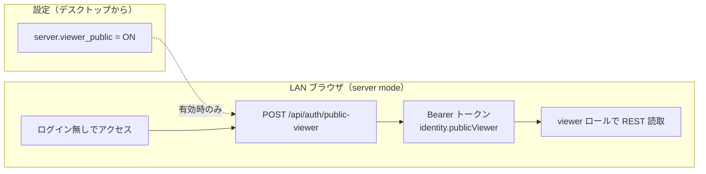

### 読み方

- 設定トグルは **デスクトップ設定**から。OFF なら public-viewer 発行は 403。
- 合成セッションは **mutating を RBAC で拒否**（監査の扱いは conventions / viewer-public-plan 参照）。
- display プリセットは初回起動シード等で閲覧公開を既定 ON にする想定（[architecture-overview.md §4](./architecture-overview.md)）。

---

## 5. 初回起動・セットアップ

プロセス起動直後のシードと、初代アカウント／ログイン不要モード／LAN オプトインの関係。

### 5.1 プロセス起動（Rust）

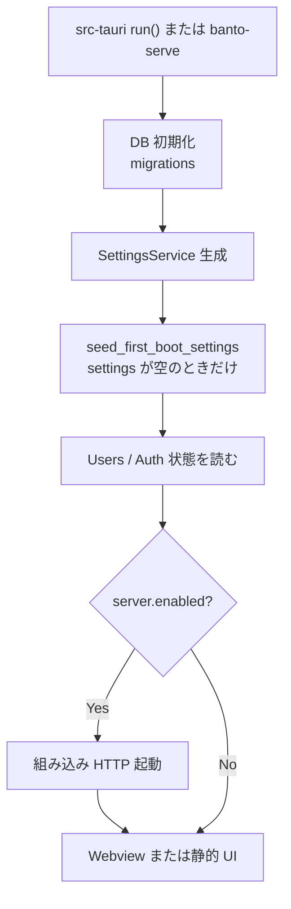

### 読み方

- **`FIRST_BOOT_SETTINGS`**（`admin-template-core` の `first_boot.rs`）はテンプレート出荷では **空**。`settings` に1行でもあればシードしない。
- `pnpm scaffold --preset display` だけが非空リストへ差し替え（認証無効・閲覧公開・LAN 公開など）。仕組み自体は常在。
- シードは **auth_config / server_config を読む前**に走るので、初回起動から既定が効く。

### 5.2 初回画面（フロント）

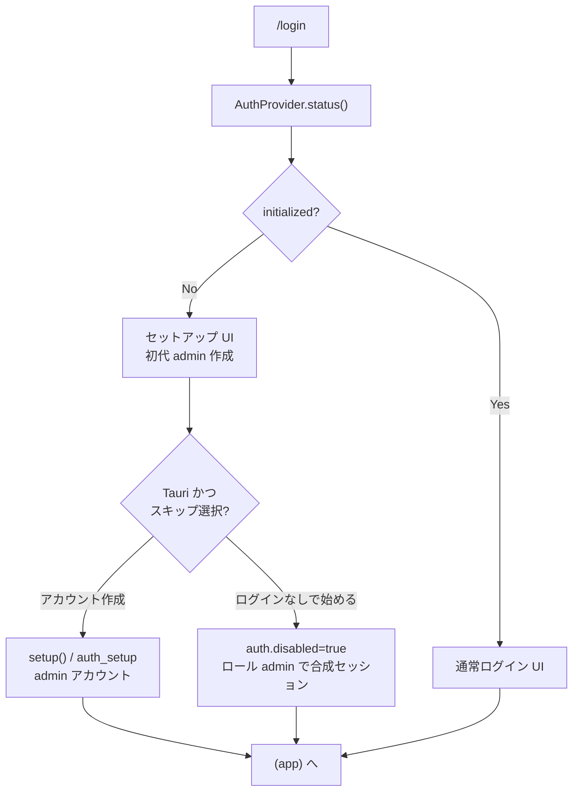

### 読み方

- **`initialized == false`** のときだけセットアップフォーム。通常は初代 admin を `setup` で作る。
- **「ログインなしで使い始める」**は **Tauri のみ**（`docs/recipes/no-login-app.md`）。LAN 初回には出ない。
- スキップはアカウント 0 のまま `auth.disabled` を ON にし、synthetic session（`local`）でダッシュボードへ。
- demo（`pnpm dev`）は別系。本物の first_boot / LAN シードは使わない。

### 5.3 LAN オプトインとの関係

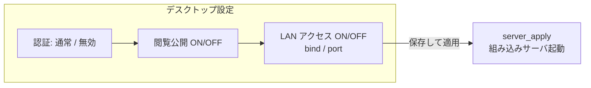

### 読み方

- 組み込みサーバは **既定 OFF**。利用者が設定で ON（または display シード）。
- **認証無効 + LAN** は、閲覧公開 ON のときだけ許可（表示専用アプリの標準形）。詳細は viewer-public / no-login レシピ。
- LAN 有効化後の URL / QR は設定画面から。ブラウザ側の入り方は [§2](#2-保護ルートへの入り方app-ガード)・[§4](#4-閲覧公開合成-viewer-の位置づけ)。

---

## 6. 開発ループの3経路

フロント／バックをどの組み合わせで回すか。いずれも同じ SvelteKit アプリだが、provider と永続化が違う（[§1](#1-起動時の3環境と-provider-選択)）。

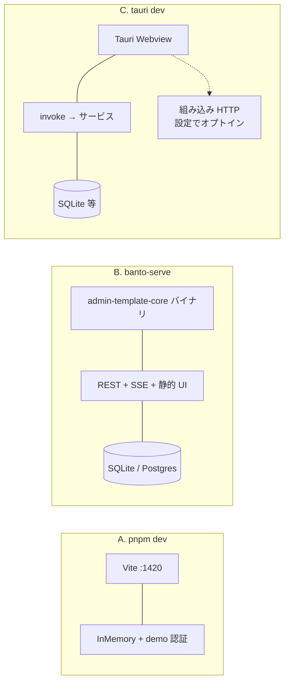

### 使い分け

| 経路 | コマンド（要約）                                                                        | mode     | 向いていること                                           |
| ---- | --------------------------------------------------------------------------------------- | -------- | -------------------------------------------------------- |
| A    | `pnpm dev`                                                                              | `demo`   | UI だけの高速イテレーション。Rust / Tauri 不要           |
| B    | `pnpm build` → `cargo run -p admin-template-core --bin banto-serve --features embed-ui` | `server` | LAN / REST を Tauri なしで確認。CI・コンテナ向き         |
| C    | `pnpm --filter admin-template tauri dev`                                                | `tauri`  | 本番に近いデスクトップ。`invoke`・キーリング・LAN トグル |

### 読み方

- **A** はバックエンドなし。データはメモリ上のデモ。認証もデモ用。
- **B** はフルスタック HTTP。既定ポート `8721`、`BANTO_DB` / `BANTO_VIEWER_PUBLIC` / `BANTO_ALLOW_SETUP` などで挙動調整。`embed-ui` 無しだとプレースホルダ UI。
- **C** の Webview は常に開発中フロントを表示。LAN クライアントに実 UI を出す本番ビルドでは `embed-ui` が別途必要（README「embed-ui」）。
- 検証の常用は `pnpm check` / `cargo test` / `pnpm e2e`（e2e は多くの場合 `banto-serve`）。`src-tauri` コンパイルはこのサンドボックスでは不可なことがある。

---

## 7. add-resource × レイヤ対応

正式手順はリポジトリの `docs/recipes/add-resource.md`。ここでは [architecture-overview.md §3](./architecture-overview.md) の層に、チェックリストの各ステップがどこを触るかを対応づける索引。

| #   | レシピのステップ                   | 主に触る層           | 置き場の目安                                       |
| --- | ---------------------------------- | -------------------- | -------------------------------------------------- |
| 1   | マイグレーション                   | 永続化（DB）         | `core/migrations-sqlite/` + `migrations-postgres/` |
| 2   | サービス層                         | サービス             | `core/src/<resource>.rs`                           |
| 3   | REST ルート                        | wiring（REST）       | `core/src/rest/<resource>.rs` + `rest/mod.rs`      |
| 4   | Tauri コマンド                     | wiring（Tauri）      | `src-tauri/src/lib.rs`                             |
| 5   | 両経路の認可対称テスト             | wiring（両経路）     | `rest/tests` / サービス・コマンドのテスト          |
| 6   | 監査イベント確認                   | wiring               | 同上（mutating のみ）                              |
| 7   | リソース定義・スキーマ             | UI + admin-core 契約 | `src/lib/banto/resources/`                         |
| 8   | ページ・ナビ                       | UI                   | `routes/(app)/…`・`navigation.ts`                  |
| 9   | ダッシュボード / CSV / e2e（任意） | UI + 検証            | `dashboard.ts`・e2e 等                             |

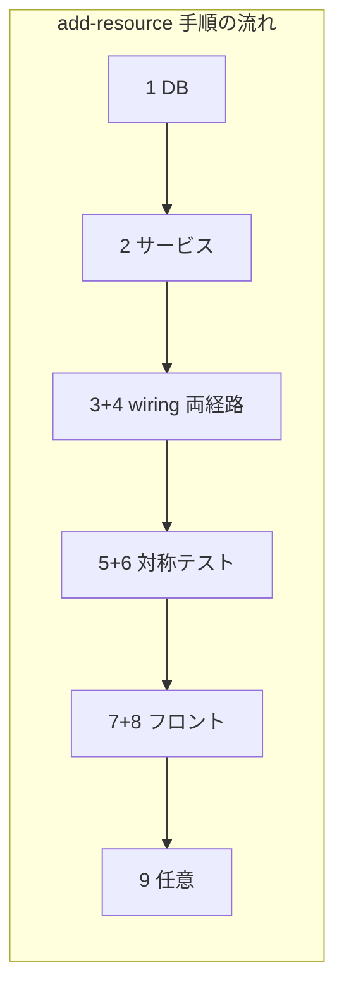

### 読み方

- **対象読者**: 新 CRUD を足すとき「いまどの層の作業か」を overview と突き合わせたい人・エージェント。
- **順序は Rust → フロント**。3 と 4 はペア（片方だけ足さない）。5・6 が対称性のゲート。
- provider 実装自体は通常いじらない（既存の Tauri/HTTP/InMemory が `DataProvider` 契約でリソース名を運ぶ）。
- InMemory デモに出すなら任意で `sampleData.ts`（[§6](#6-開発ループの3経路) の経路 A）。出さない機能は demo で明示拒否。
- 更新1回の実行時の流れは [architecture-overview.md §6](./architecture-overview.md) と本ファイルの認証節を参照。

---

## 関連ドキュメント（リポジトリ）

| 用途                      | パス                                                                                  |
| ------------------------- | ------------------------------------------------------------------------------------- |
| provider 契約             | `packages/admin-core/src/provider.ts`                                                 |
| HTTP 認証実装             | `packages/admin-core/src/providers/http.ts`                                           |
| 組成・3環境               | `apps/admin-template/src/lib/banto/setup.ts`                                          |
| 埋め込みサーバ判定        | `apps/admin-template/src/lib/banto/environment.ts`                                    |
| ルートガード              | `apps/admin-template/src/routes/(app)/+layout.ts`                                     |
| 初回シード                | `apps/admin-template/core/src/first_boot.rs`                                          |
| ログイン／セットアップ UI | `apps/admin-template/src/routes/login/+page.svelte`                                   |
| ログイン無しレシピ        | `docs/recipes/no-login-app.md`                                                        |
| display 既定              | `docs/display-preset-plan.md`                                                         |
| 開発コマンド              | `README.md`「開発」「`banto-serve`」                                                  |
| CRUD 追加手順             | `docs/recipes/add-resource.md`（本ファイル §7 は層の索引）                            |
| 閲覧公開計画              | `docs/viewer-public-plan.md` / `docs/adr/0012-lan-public-viewer-synthetic-session.md` |
