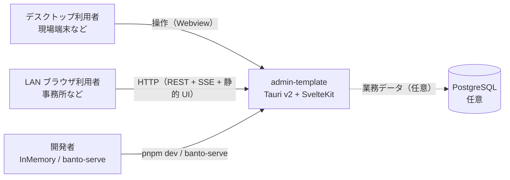
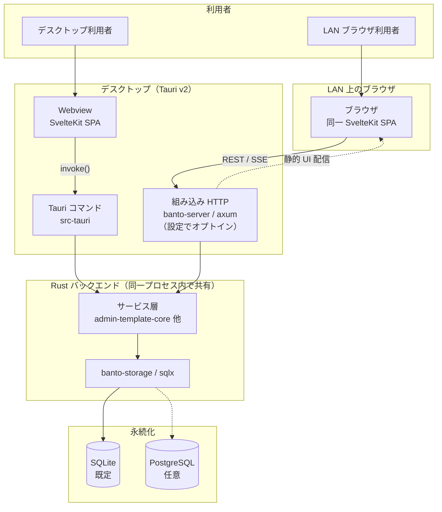
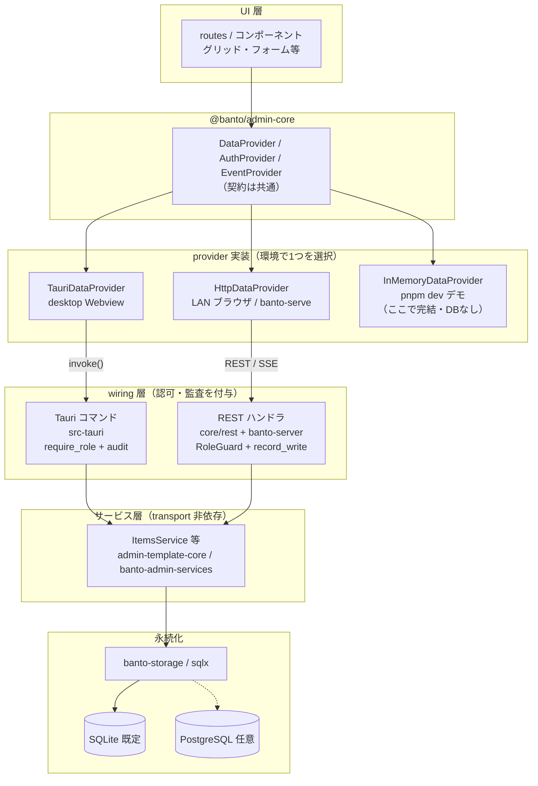
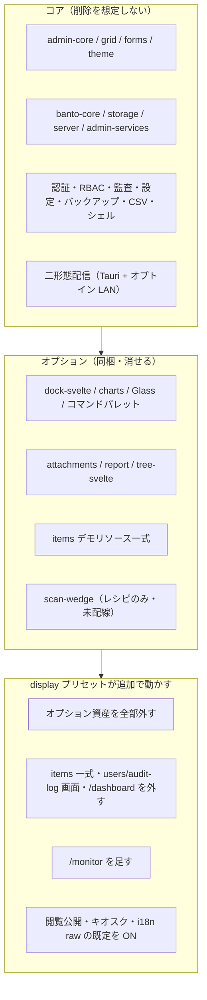
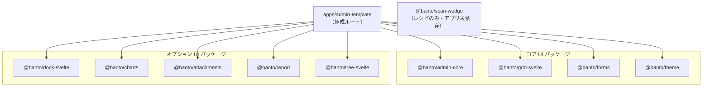
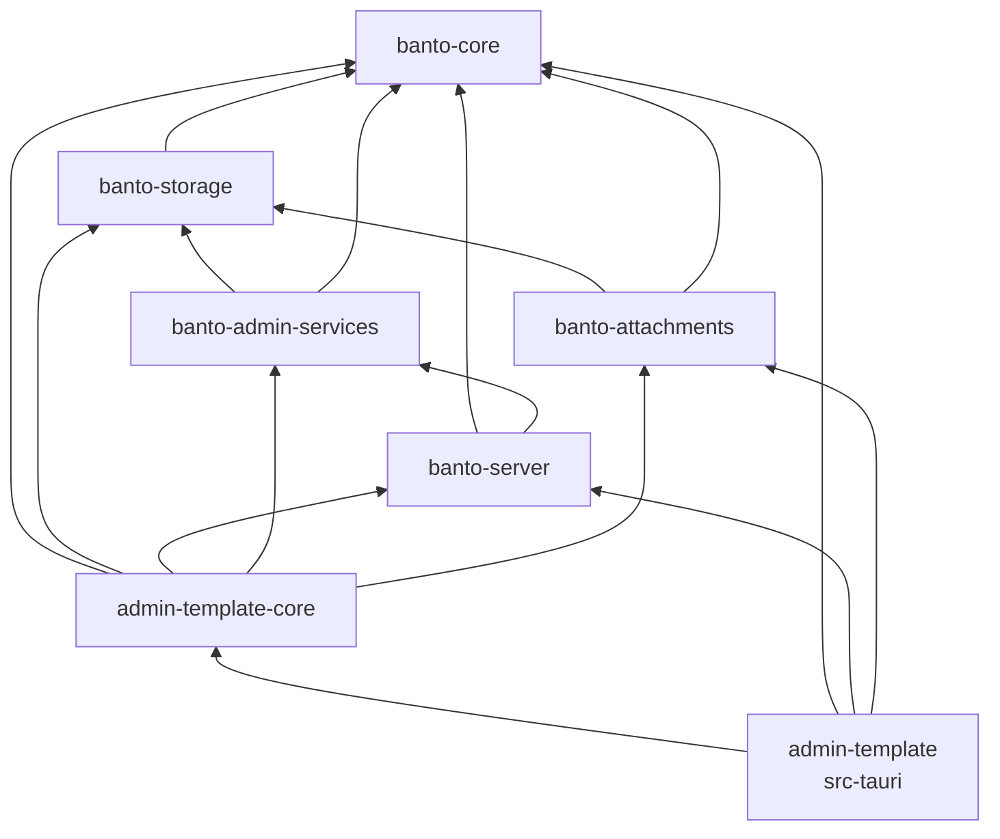
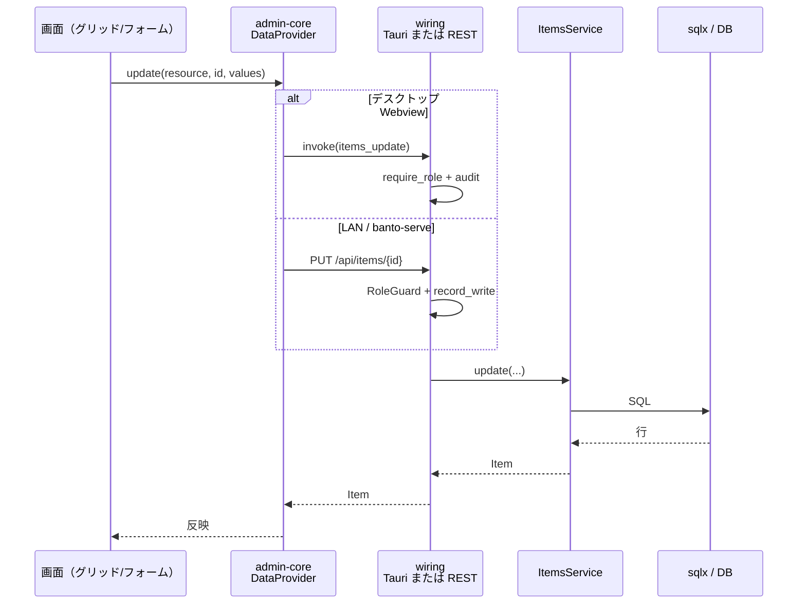

# Banto 全体構成図

対象: テンプレートの「何がどこで動くか」を一望したい人（アプリ作者・新規参画者）。
Context / Container / レイヤ / 機能マップ / パッケージ依存 / 典型フローを本書に集約。

## 目次

1. [コンテキスト（C4 Context）](#1-コンテキストc4-context-相当)
2. [コンテナ（C4 Container）](#2-コンテナc4-container-相当)
3. [レイヤ構成](#3-レイヤ構成provider--wiring--サービス--db)
4. [機能マップ](#4-機能マップコア--オプション--display)
5. [パッケージ依存関係](#5-パッケージ依存関係)
6. [典型フロー（更新1回）](#6-典型フロー更新1回)
7. [関連ドキュメントと置き場](#7-関連ドキュメントと置き場)

---

## 1. コンテキスト（C4 Context 相当）

利用者と Banto アプリの関係。デスクトップと LAN ブラウザの二形態が同じアプリを指す。

（C4 Context 相当。GitHub 等でプラグイン無しでも描画できるよう `flowchart` で記述。）

### 読み方

- **誰が何を使うか**だけを示す図。内部のフロント/バック分割は次節。
- 現場はデスクトップ、事務所はブラウザ、という二形態が同じ `admin-template` に集約される点が本題。
- PostgreSQL は外部オプション。既定の永続化はアプリ内 SQLite（次節）。
- 開発者向けの InMemory デモ / `banto-serve` は本番二形態の外側の検証経路。

---

## 2. コンテナ（C4 Container 相当）

プロセスと主要技術の置き場。二形態でフロントは共通、到達経路だけが分岐する。

### 読み方

- **対象読者**: 「フロントは何か・バックは何か・DB は何か・二形態はどうつながるか」を知りたい人。
- フロントはどちらも **SvelteKit（`adapter-static` の SPA）**。デスクトップは Webview、LAN はブラウザ。
- デスクトップ経路は **Tauri `invoke()` → サービス層**。LAN 経路は **HTTP（`banto-server` / axum）→ 同じサービス層**。
- 組み込みサーバは既定オフ。有効化すると同一 Rust プロセスから REST・SSE・静的 UI を LAN へ出す。
- DB は **SQLite 既定**。`BANTO_DB` を `postgres://` にすると PostgreSQL。図の点線はその任意経路。

---

## 3. レイヤ構成（provider → wiring → サービス → DB）

リクエストが上から下へどう流れるか。UI は実行環境を知らず、provider の差し替えだけで分岐する。

### 読み方

- **対象読者**: 「画面の操作が DB までどう届くか」「なぜ REST と Tauri が両方あるか」を知りたい人。
- **上から下**: UI → `@banto/admin-core` の契約 → provider 実装 → wiring → サービス → DB。
- provider は起動時に環境判定で選ぶ（`setup.ts`）: Tauri / HTTP / InMemory の3種。**UI コードは分岐しない**。
- Tauri と REST はどちらも同じサービス（例: `ItemsService`）を呼ぶ。違うのは **wiring で付ける認可・監査と transport**（`origin` が `"tauri"` / `"rest"`）。
- サービス層は axum / tauri / HTTP を知らない。DB アクセスは `banto-storage`（sqlx）経由。
- InMemory はデモ専用で、サービス層・DB には入らない。
- **図の省略**: `EventProvider` / `UiSettingsProvider` も環境ごとに差し替わるが、CRUD の主経路ではないため本図では Data/Auth に絞っている（詳細は [`architecture-flows.md` §1](./architecture-flows.md)）。

---

## 4. 機能マップ（コア / オプション / display）

何が常在で、何が外せて、`pnpm scaffold --preset` でどう変わるかの俯瞰。詳細な削除手順は README「オプション資産の削除」側。

### プリセットで残るオプション（概略）

コアは全プリセットで常在。下表はオプション資産のみ（✓＝残す / ✗＝外す）。

| オプション | minimal | standard | full | display |
|---|:---:|:---:|:---:|:---:|
| charts / dock / Glass / コマンドパレット | ✗ | ✓ | ✓ | ✗ |
| attachments / report / tree | ✗ | ✗ | ✓ | ✗ |
| scan-wedge | ✗ | ✗ | ※ | ✗ |
| items デモ一式 | ✓ | ✓ | ✓ | ✗（追加削除） |

※ `scan-wedge` は現状テンプレート未配線（レシピのみ）。`full` でも自動配線しない想定。

**display だけが「足す」プリセット**: `/monitor` 追加と、閲覧公開・キオスク・`banto.i18n = "raw"` の既定反転。users / audit-log は**画面だけ**外し、サービス層・REST・Tauri は残る。

### 読み方

- **対象読者**: コピー直後に「何を残し何を外すか」を決めたいアプリ作者。
- **コア** = 管理画面テンプレートの背骨。認証・監査・グリッド・二形態配信など。
- **オプション** = 同梱するが `scaffold` または手作業で外せる。コア→オプションの逆依存は禁止。
- **出荷状態**は full 寄りの配線済み（attachments/report 含む）。`scaffold` は基本「引く」操作。
- **display** は表示専用（カンバン／常設ダッシュボード等）向けの例外。デモ CRUD を外し、閲覧公開を既定にする。

---

## 5. パッケージ依存関係

フロントの `@banto/*` は互いに依存せず、アプリが組成する。Rust は下位へ向かう一方向 DAG。

### 5.1 フロント（pnpm workspace）

### 5.2 Rust（cargo workspace）

### 読み方

- **対象読者**: パッケージを外す・足すときに「誰が誰を import してよいか」を知りたい人。
- **フロント**: `@banto/*` 同士に `dependencies` はない（単体ライブラリとしても使える）。依存はすべて `admin-template` が持つ。外すときはアプリ側の依存とデモ配線を切ればよい。
- **`scan-wedge`**: パッケージはモノレポにあるが、アプリの `package.json` には入っていない（レシピ組み込み）。
- **Rust**: 矢印は「依存する先」（下位）。`banto-core` が最下位。`admin-template-core` がサービス＋REST 組み立て、`src-tauri` がその上の Tauri 配線。
- **図の省略**: 開発用バイナリ `banto-serve` は `admin-template-core` の bin で、同じクレート DAG に乗る（別ノードとしては描いていない）。
- **コア → オプションの逆依存は禁止**（例: `admin-core` が `charts` を import しない）。オプションはアプリまたは上位配線からのみ参照する。

---

## 6. 典型フロー（更新1回）

一覧で行を編集して保存するときの流れ（mutating 操作の例）。読み取り系は監査しない。

### 読み方

- **対象読者**: 新リソース追加時に「どの層を触るか」を §3 と対応づけたい人。
- デスクトップと LAN で **wiring だけが違い、サービス層以降は同一**（`docs/adr/0001-rest-tauri-two-path-symmetry.md` の意図）。
- 新リソースはこの流れに沿って **REST と Tauri をペアで足す**（手順は `docs/recipes/add-resource.md` のチェックリスト step 2–4）。
- InMemory デモは provider 内で完結し、本図の wiring / サービス / DB には入らない。

---

## 7. 関連ドキュメントと置き場

深掘り用の索引。規約・仕様の一次情報は各リンク先。

### ドキュメント

| 用途 | ドキュメント |
|---|---|
| エージェント・保守者の索引 | `AGENTS.md` |
| 不変条件（REST/Tauri 対称など） | `docs/conventions.md` |
| スコープ（コア/オプション判定） | `docs/template-scope.md` |
| 仕様の基準線 | `docs/ui-framework-spec.md` |
| CRUD リソース追加の正式手順 | `docs/recipes/add-resource.md` |
| 二経路対称の設計判断 | `docs/adr/0001-rest-tauri-two-path-symmetry.md` |
| scaffold プリセット | `docs/design/scaffold-presets-plan.md` / README「オプション資産の削除」 |
| 認証・起動・開発・add-resource 索引 | [architecture-flows.md](./architecture-flows.md) |

### コードの置き場

| 役割 | 主な場所 |
|---|---|
| フロント（SvelteKit） | `apps/admin-template` / `packages/*` |
| provider 契約・実装 | `packages/admin-core`（`providers/tauri.ts` / `http.ts` / `inMemory.ts`） |
| provider 選択（組成） | `apps/admin-template/src/lib/banto/setup.ts` |
| Tauri 配線 | `apps/admin-template/src-tauri` |
| REST 配線・アプリサービス | `apps/admin-template/core`（`rest/`・`items.rs` 等） |
| 組み込みサーバ | `crates/banto-server` |
| ストレージ（sqlx） | `crates/banto-storage` |
| 汎用サービス | `crates/banto-admin-services` / `crates/banto-core` |
| 開発バイナリ（LAN 相当） | `admin-template-core` の `banto-serve` bin |
